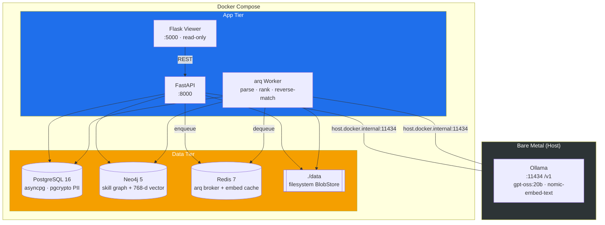
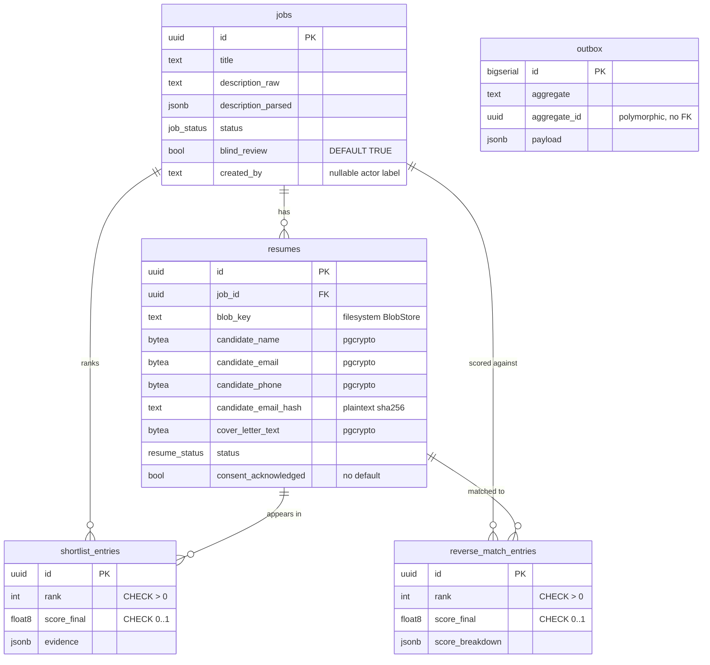

# recruiter-assistant

> Local-first, evidence-backed resume ranking. Upload a job and a stack of resumes; get a ranked shortlist where every claim is a quote verified against the candidate's own document. Inference runs on **Ollama on the host** — no candidate data ever leaves the machine.

Ported from the resume-ranking feature of an internal HRIS onto the offline-first agent harness. The review workflow, JD-Harmonizer, and cloud object storage were dropped; anonymization, the 4-stage ranking engine, shortlists, reverse-match, and exports were kept. See [docs/EXTRACTION_PLAN.md](docs/EXTRACTION_PLAN.md) for the full keep/cut boundary and the phased build.

---

## What it does

- **Blind by default** — candidate name / email / phone are redacted in the viewer and excluded from embeddings; reveal is opt-in and audited (decision 4).
- **Evidence-backed** — the LLM produces per-requirement evidence, then an anti-fabrication pass fuzzy-matches every quote (≥ 0.85) against its cited resume chunk; unverifiable quotes are blanked.
- **Hybrid ranking** — Neo4j vector recall + a structured skill/experience/education/seniority score + evidence completeness + motivation.
- **Offline** — all model calls go through an OpenAI-compatible client pointed at Ollama on `host.docker.internal:11434`. No cloud endpoint exists anywhere in the code or compose.

---

## System architecture



**Store responsibilities**

| Store | Role |
|---|---|
| **PostgreSQL** (raw asyncpg) | Transactional data: jobs, resumes, shortlist / reverse-match entries, outbox. Candidate PII is encrypted at rest with pgcrypto. |
| **Neo4j** | Skill / experience graph + four 768-d cosine vector indexes for coarse recall and skill-graph scoring. |
| **Redis** | arq task broker + embedding cache. No domain data. |
| **`./data` BlobStore** | Original resume + cover-letter files on the local filesystem — MinIO was dropped (see ADR-004). Implemented in Phase 1 as an async `BlobStore` (see below). |

There is **no migration framework**: `init_schema` (Postgres) and `bootstrap_neo4j_schema` (Neo4j) run idempotently on every API/worker boot. The `BlobStore` bootstraps its root directory on construction (bucket-bootstrap parity), also with no migration step.

### Filesystem BlobStore

`core/src/storage/blob_store.py` — an async `BlobStore(root)` rooted at `settings.storage_dir` (default `/data`, bind-mounted to `./data`), stdlib-only (`pathlib` / `asyncio` / `os`; no `aiofiles` or S3/MinIO dependency). Every op runs its blocking filesystem IO in `asyncio.to_thread`. Interface: `put(key, data, content_type=None)` · `get(key) -> bytes` (raises `BlobNotFound`) · `delete(key)` (missing key is a no-op success) · `exists(key) -> bool` · `list_keys(prefix="") -> list[str]` (sorted, root-relative, POSIX-separated; **directory-scoped** prefix, not MinIO substring-prefix). The store is a dumb byte sink — it never parses or extracts text, so nothing here feeds an embedding path.

**Path-safety & at-rest perms.** Every key-taking method funnels through one `_resolve` guard (before any IO) that raises `InvalidBlobKey` on `..` segments, absolute / Windows-drive / backslash keys, empty or root-resolving keys, null-byte keys, and symlink escapes (realpath + `is_relative_to`); `list_keys` applies the same realpath filter so an escaping symlink cannot be enumerated. Store-created directories are `0o700` and blobs are `0o600` — the PIPEDA/FIPPA control for raw resume bytes at rest (blobs are permission-gated; Postgres PII columns are pgcrypto-encrypted — two different at-rest controls). Interface and rationale: [ADR-005](docs/adr/005-filesystem-blobstore-interface-path-safety.md).

The store is wired onto `app.state.blob_store` (with a `get_blob_store` FastAPI dependency) in the API lifespan and onto `ctx["blob_store"]` in the worker startup. It has **no HTTP surface yet** — the upload/fetch/flush call sites that invoke it are ported in Phases 3–6.

---

## Data model (Postgres)



Five tables (`jobs`, `resumes`, `shortlist_entries`, `reverse_match_entries`, `outbox`). The four PII columns (`candidate_name` / `candidate_email` / `candidate_phone` / `cover_letter_text`) are `BYTEA` encrypted via `pgp_sym_encrypt` under the `app.pii_key` GUC; only `candidate_email_hash` is plaintext, and only so subject-access requests can find a candidate. Full column list and the three deliberate deviations from the source schema are in [ADR-004](docs/adr/004-phase-0-storage-schema-embedding-contract.md).

---

## Neo4j schema

`bootstrap_neo4j_schema` creates 5 node uniqueness constraints (`Job`, `Resume`, `Skill`, `Company`, `Institution`) and four 768-d cosine vector indexes (`resume_summary_idx`, `job_summary_idx`, `skill_emb_idx`, `chunk_emb_idx`). The `768` is read from `settings.llm_embedding_dim` — one number, one place — so the indexes can never drift from the embedding model.

`ResumeChunk` deliberately has **no** uniqueness constraint on `id`: chunk ids (`c_001`, `c_002`, …) are deterministic per-resume and intentionally collide across resumes. A stale `chunk_id_unique` constraint is actively dropped on bootstrap; re-adding it silently caps every shortlist at one candidate.

---

## Schemas

`core/src/schemas/` is the pydantic **v2** contract layer (Phase 2) — three modules plus an `__init__` re-export (`from src.schemas import JobCreate, ResumeParsed, MatchWeights, …`). Pure data models: no I/O, no services, no routes. They are the contract for four things at once — the API request/response DTOs, the strict LLM `chat_json` output schemas, the jsonb columns persisted verbatim, and the ranking weights. The routes/pipeline that consume them land in Phases 3–6.

| Module | Contract for |
|---|---|
| `jobs.py` | `JobCreate`/`JobUpdate`/`JobTransition`/`JobOut`/`JobDeleteOut`/`JobListItem`, `JDExtractText`, `BulkJobResult` (job API DTOs); `Skill`/`Education`/`JDExtracted` (LLM extraction → `jobs.description_parsed` jsonb). |
| `resumes.py` | `ResumeParsed`/`ResumeCore`/`ResumeSkill*`, `CandidateInfo`, `CoverLetterParsed` (LLM/jsonb parse shapes); `ResumeOut`/`ResumeListItem`/`ResumeUploadResult`/`ResumeDeleteOut` (resume API DTOs). Carries `_coerce_year` (two-digit-year pivot) and the lossy `_drop_invalid_rows`/`_coerce_*` pre-validators so one malformed row never fails a whole parse. |
| `matching.py` | `MatchWeights` (+ `DEFAULT_WEIGHTS`) — the ranking-weight contract; `ScoreBreakdown`/`EvidenceObject`/`PipelineMeta` (jsonb shapes); `ShortlistEntry`/`JobMatchEntry`/`JobMatchResultOut` (shortlist / reverse-match DTOs). |

**Review workflow cut.** The 2nd-review pipeline the source carried is not ported and is not importable: `PipelineStage`, `DispositionReason`, `ShortlistDecision*`, `StageTransition*` are gone, `ShortlistEntry` drops `current_decision`/`current_stage` (keeping only the blind-review `blinded`/`display_label`), and `JobListItem` drops the Taleo/JD-comment columns. A merge-blocking cut-guard test keeps them out.

**`MatchWeights` = the ranking weights.** A frozen model whose defaults encode the algorithm — `0.6·structured + 0.3·evidence + 0.1·motivation` on top, `0.40·skill + 0.25·exp + 0.10·edu + 0.15·seniority + 0.10·vector` below, `evidence_verify_fuzz = 0.85` (the anti-fabrication quote threshold). A sums-to-1.0 validator rejects any weight vector that would silently rescale scores. This is the single source of the ranking constants; Phase 4's scorer reads them.

The DTOs are aligned to the Phase 0 DDL at three points, and the redaction boundary is recorded: `ResumeOut`/`ResumeListItem` expose *decrypted* PII (`candidate.*`, `candidate_name`, `cover_letter_text`) with a `blinded` flag the schema does not act on — Phase 5 redaction must mask those fields before DTO construction. Full boundary + deviations: [ADR-006](docs/adr/006-schema-port-trim-ddl-alignment.md).

---

## Ingest & parse pipeline

`core/src/pipeline/{parsing,llm,skills}/`, `core/src/services/`, `core/src/worker/{tasks,resume_tasks}.py` (Phase 3) — ports the résumé/JD ingest pipeline from hris. `extract_text` (PyMuPDF / python-docx / striprtf) enforces three input-safety caps at the trust boundary, independent of any Phase 6 upload-side cap: a 10 MB raw-blob cap, a 300-page PDF cap (malformed-page-tree exceptions wrapped to a typed error), and a 50 MB DOCX decompression ceiling enforced by streaming *real* decompressed bytes rather than trusting the zip's forgeable central-directory size. `LLMClient` is the pipeline's only egress — hand-rolled on `httpx` against `settings.llm_base_url` (no `openai` dependency), with retry/circuit-breaker and a Redis-backed `CachedEmbedder` (`emb:v1:*` keyspace, on the same Redis instance as the arq broker — a recorded deviation from "Redis only as arq broker"). The `parse_job`/`parse_resume` arq tasks encrypt candidate PII at rest via pgcrypto (`services/pii.py`, strict `current_setting('app.pii_key')`; the worker now fails loud at startup if `PII_KEY` is unset) and write a `resume.parsed`/`job.parsed` outbox row for Phase 4's graph projection. The outbox payload deliberately excludes the candidate block, raw chunk/summary text, and carries only embeddings that have been scrubbed of candidate identifiers at the embed boundary — no candidate identity rides into Neo4j. Graph projection itself (`project_to_graph`) is deferred to Phase 4. Full PII-at-rest boundary and the merge-blocking audit rounds that shaped it: [ADR-007](docs/adr/007-phase3-ingest-parse-hardening.md).

---

## Ranking algorithm

Four stages, implemented in `core/src/pipeline/matching/{stages,orchestrator}.py` (Phase 4c):

1. **Coarse recall** — Neo4j `resume_summary_idx` vector query, scoped to the job, 3× oversample → k = 50.
2. **Structured score** — `0.40·skill + 0.25·exp + 0.10·edu + 0.15·seniority + 0.10·vector` over the skill graph, with ontology partial-credit, years/recency weighting, and a must-have-miss penalty (keyed off the candidate's actual ontology match, not a raw zero score — see [ADR-009](docs/adr/009-matching-engine-port.md)).
3. **Evidence** — LLM per-requirement evidence, then anti-fabrication verify: every quote fuzzy-matched (`rapidfuzz.fuzz.partial_ratio` ≥ 0.85) against its cited résumé chunk, or blanked.
4. **Combine + rank** — `0.6·structured + 0.3·evidence_completeness + 0.1·motivation` → ranked entries. Reverse-match (résumé → jobs) reuses stages 2–4 against an inverted stage-1 query.

Embeddings **exclude** name/email/phone by construction. 768-d `nomic-embed-text`, cosine — matching the Neo4j indexes. `MatchWeights` is sourced from `Settings` via `weights_from_settings`, and (Phase 4d) `matching_context_from_settings` is the single call site that builds the rest of `MatchingContext` (family weight, concurrency, model names, `git_sha`) from `Settings` too — no hard-coded tunables reach a real worker run.

**Write path (Phase 4d, `core/src/worker/matching_tasks.py` + `core/src/services/shortlist_service.py`):** the arq tasks `shortlist_job`/`reverse_match_job` run the orchestrator and persist the result with `persist_shortlist`/`persist_reverse_match` — raw asyncpg, DELETE-first per run (rerun replaces, never duplicates), into `shortlist_entries`/`reverse_match_entries` (Postgres only; there is no Neo4j `SHORTLISTED` edge write in this repo). The two persist functions are deliberate mirror images of each other (dictated by the two tables' different column shapes — see [ADR-010](docs/adr/010-shortlist-reverse-match-write-path.md)): `shortlist_entries` has no dedicated `score_structured`/`score_evidence` columns and a `NOT NULL` evidence column, so those scores are folded into the `score_breakdown` jsonb and a missing evidence object is written as `{}`; `reverse_match_entries` has dedicated columns and a nullable evidence column, written as SQL `NULL` when absent. Evidence quotes are persisted verbatim — no redaction happens at this write layer (display-time redaction is Phase 5, below).

**Read + export path (Phase 5, `core/src/services/{shortlist_service,resume_service,redaction}.py`):** `shortlist_service.list_for_job`/`get_one`/`export_rows` and `resume_service.list_for_job`/`get_one(reveal=...)` read the same tables back. Under blind review (`jobs.blind_review`, default `TRUE`), every one of these paths redacts BEFORE building the response DTO — never after — closing [ADR-006](docs/adr/006-schema-port-trim-ddl-alignment.md) §4's redaction-boundary contract in code: `redact_text` masks name/email/phone-shaped substrings and relabels employers/schools to stable pseudonyms ("Employer A"), `pseudonym(rank)` replaces the candidate's name in shortlist rows, and foreign (non-Canadian) locations are masked while Canadian ones stay visible. This is **display-only** — it changes what a blind caller's response contains, not what Postgres stores; ADR-007 §6/§7's cleartext-at-rest posture is unchanged. `shortlist_csv`/`shortlist_evidence_csv`/`shortlist_json` are pure formatters over `export_rows`' already-redacted output. `original_filename` is also masked under blind (`redacted_filename()` returns a generic `resume<ext>`) — closed by a post-first-green fix rather than left open. Full boundary + accepted residuals: [ADR-011](docs/adr/011-display-redaction-read-export-boundary.md).

---

## API layer (Phase 6)

`core/src/api/routes/{jobs,resumes,shortlist}.py` — eleven routes over the service layer Phases 3–5
built, plus `core/src/api/deps.py`'s configurable auth switch. **Not yet merged** — see "Status &
roadmap" below.

| Method | Path | Purpose |
|---|---|---|
| POST / GET | `/jobs` | Create a draft job (enqueues `parse_job`) / list |
| GET / PATCH | `/jobs/{id}` | Get one / update |
| PATCH | `/jobs/{id}/status` | The only status-mutating route — forward-only, 409 on an invalid transition |
| POST | `/jobs/jd-extract` | Pre-fill helper — extract JD text from an upload, no DB write |
| POST / GET | `/jobs/{id}/resumes` | Upload résumés (multi-file or `.zip`) / list |
| GET | `/resumes/{id}` | Get one résumé (redacted under blind review) |
| POST | `/resumes/{id}/match-jobs` | Trigger reverse-match (enqueues `reverse_match_job`) |
| GET | `/resumes/{id}/match-results` | Read reverse-match result — **no redaction** (the caller owns the résumé) |
| GET / PATCH | `/jobs/{id}/shortlist` | List / (schema-level) |
| GET | `/jobs/{id}/shortlist/export` | Export csv / evidence-csv / json, `reveal` query param |
| GET | `/shortlist/{id}` | Get one shortlist entry |

**Auth** is one settings flag, `Settings.api_key`: empty (default) disables auth entirely — every route
unauthenticated, correct for local-only offline dev, with a loud startup `WARNING`; non-empty enables
fail-closed 401 via a constant-time (`secrets.compare_digest`, UTF-8 bytes) `X-API-Key` header check. An
optional `X-Actor-Name` header (capped at 128 chars) populates the nullable `created_by`/`uploaded_by`
audit columns.

**Upload** accepts local multi-file or a single `.zip` (expanded, one entry = one résumé) — the
Taleo/CSV-manifest connector is explicitly cut and deferred to a future connectors feature. The zip guard
(`core/src/services/zip_upload.py`) mirrors the Phase-3 DOCX decompression-bomb defense: never trusts the
archive's declared entry size, streams and sums real decompressed bytes, and rejects path-traversal
entries, disallowed extensions, and per-entry/total/entry-count overages before writing anything.

Full decisions + residuals: [ADR-012](docs/adr/012-api-routes-auth-upload-scope.md); activity report:
[docs/activity/phase-6-api-routes.md](docs/activity/phase-6-api-routes.md).

---

## Status & roadmap

**Phases 0–5 are merged to `main`, CI green** — all four Phase-4 sub-phases (4a evals corpus, 4b graph projection, 4c matching engine, 4d shortlist/reverse-match write path) and Phase 5 (persist + anonymize + export, PR #14) are merged. **Phase 6 (API routes)** is complete and gate-green on branch `feat/phase-6-api-routes` (tip `837de9e`) but not yet opened as a PR. See [HANDOFF.md](HANDOFF.md) for exact commit/PR state. What is live on `main` today: `docker compose up` brings up the stack, Postgres + Neo4j schema come up idempotently on boot, the ingest/parse pipeline, the Neo4j skill graph, the 4-stage matching engine, the shortlist/reverse-match write path, and the persist/anonymize/export read layer are wired, and the API serves `/health`. **There are still no job/resume/shortlist HTTP routes on `main`** — Phase 6's route layer (above, not yet merged) is the first thing that exposes any of this over HTTP.

| Phase | Deliverable | State |
|---|---|---|
| **0 · Seed & infra** | Compose, settings (768-d contract), asyncpg startup DDL, Neo4j bootstrap | **done** |
| **1 · Storage** | Filesystem `BlobStore` (put/get/delete/exists/list_keys, path-safe, `0o600`/`0o700`) + app/worker wiring | **done** |
| **2 · Schemas** | `jobs`, `resumes`, `matching` pydantic schemas (review workflow cut; `MatchWeights` ranking contract) | **done** |
| **3 · Ingest + parse** | extract/chunk, LLM client+cache, PII encryption on parse, `parse_job`/`parse_resume` | **done, merged** |
| **4a · Evals corpus** | Labelled resumes-vs-JD fixture corpus + `thresholds.toml` | **done, merged** |
| **4b · Graph projection** | Outbox drainer + Neo4j skill graph (`skill_normalize`, ADR-008 PII-safe-by-construction) | **done, merged** |
| **4c · Matching engine** | `stages`/`orchestrator` (4-stage hybrid), reverse-match, `weights_from_settings` | **done, merged** |
| **4d · Shortlist + reverse-match write path** | `shortlist_job`/`reverse_match_job` arq tasks, `persist_shortlist`/`persist_reverse_match`, `matching_context_from_settings` | **done, merged** |
| **5 · Persist + anonymize + export** | `list_for_job`/`get_one`/`export_rows`, `redaction.py`, csv/evidence-csv/json export with `reveal` | **done, merged (PR #14)** |
| **6 · API** | job/resume/shortlist/reverse-match routes (above), configurable auth | **done, gate-green, not yet merged** |
| 7 · Evals + viewer | precision@k / evidence-verification fixtures (live, wired in 4c), Flask viewer | pending — **next sub-phase**; partially done (harness) |

Full plan: [docs/EXTRACTION_PLAN.md](docs/EXTRACTION_PLAN.md). Architecture decisions: [docs/adr/](docs/adr/).

---

## Quick start

```bash
# 0. Prereq on host: Ollama running on metal with the two models pulled
ollama serve &
ollama pull gpt-oss:20b nomic-embed-text

# 1. Configure — PII_KEY is REQUIRED (32 random bytes, base64)
cp .env.example .env
#   set PII_KEY, e.g.:  openssl rand -base64 32

# 2. Bring up the stack
docker compose up -d          # postgres, neo4j, redis, api, worker, frontend
# Postgres tables + Neo4j vector indexes are created on API startup —
# no separate migration step.

# 3. Check the API
curl localhost:8000/health    # -> {"status":"ok"}
```

`PII_KEY` protects every encrypted candidate column. Losing it makes those columns unrecoverable; never commit it.

---

## Gates

`make gates` is the **offline** default — no Docker required, green on a fresh clone:

1. `ruff check` — lint
2. `black --check` — format
3. `mypy --strict` — types (no unjustified `# type: ignore`)
4. `pytest tests/unit` — unit tests (drivers mocked; no live services)
5. Coverage ≥ **80%**
6. Branch name matches `agent/<task-id>-<slug>` or `feat|fix|chore/<slug>`

`make gates-integration` runs the testcontainers suite (real Postgres + Neo4j) and needs a Docker socket. CI runs `make gates-all`.

---

## Repository layout

```
recruiter-assistant/
├── core/
│   ├── src/
│   │   ├── api/         # FastAPI app (/health + lifespan; wires blob_store/arq); deps.py auth switch + routes/{jobs,resumes,shortlist}.py (Phase 6)
│   │   ├── models/      # asyncpg pool + idempotent startup DDL
│   │   ├── pipeline/    # extract/chunk, LLM client+cache, skills scan (Phase 3); matching/{stages,orchestrator} 4-stage ranking engine (Phase 4c/4d)
│   │   ├── prompts/     # Jinja prompt templates: jd_extract/resume_core/resume_skills/cover_letter (Phase 3)
│   │   ├── schemas/     # pydantic contract layer: jobs/resumes/matching (Phase 2)
│   │   ├── services/    # pii, job/resume/outbox services (Phase 3); shortlist_service persist (Phase 4d) + list/get/export (Phase 5); redaction.py, errors.py (Phase 5); zip_upload.py, jd_import_service.py (Phase 6)
│   │   ├── storage/     # filesystem BlobStore (Phase 1)
│   │   ├── worker/      # arq worker + Neo4j bootstrap; parse_job/parse_resume (Phase 3); shortlist_job/reverse_match_job (Phase 4d)
│   │   └── settings.py  # single source of truth (pydantic-settings)
│   ├── frontend/        # Flask viewer (Phase 0: stub)
│   └── tests/{unit,integration}/
├── CLAUDE.md            # Claude Code instruction layer (auto-read)
├── .claude/            # build subagents + commands
├── docs/{adr,}          # ADRs + the extraction plan
├── docker-compose.yml   # pg · neo4j · redis · api · worker · frontend
├── Makefile             # gates + stack controls
└── .env.example
```
