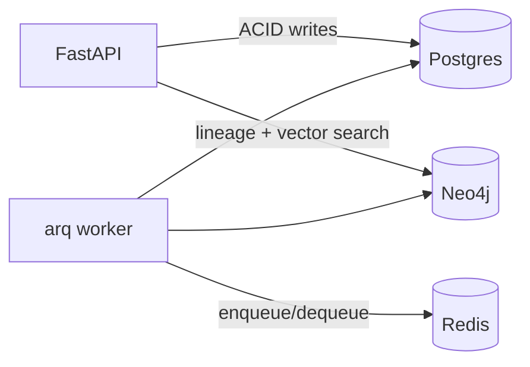

# ADR-002: Neo4j as Agent Memory, Postgres as Transaction Ledger

**Status:** Accepted
**Date:** 2026-07-09

## Context

Agents need two very different kinds of persistence: (a) an auditable, transactional record of tasks, runs, and gate results, and (b) an associative memory answering "what have we built before that resembles this?" plus lineage traversal ("which agent produced which artifact for which task?").

## Decision

Split by access pattern, not by "one database to rule them all":

- **Postgres** — tasks, runs, gate results, audit rows. ACID, Alembic-migrated, queried by the API and Flask dashboard.
- **Neo4j** — lineage graph `(:Task)-[:DECOMPOSED_INTO]->(:Subtask)-[:EXECUTED_BY]->(:Agent)`, artifacts with a 768-dim vector index (`nomic-embed-text` via Ollama). Agents query it before implementing.
- **Redis** — arq broker/results only; no domain data.

## Consequences

- Clear ownership: a datum lives in exactly one store
- Vector retrieval gives agents genuine reuse of prior work
- Two migration systems (Alembic + Cypher files) — mitigated by `make migrate` running both

## Alternatives Considered

- **pgvector only**: workable for vectors, weak for lineage traversal; rejected
- **Neo4j only**: no strong transactional guarantees for the run ledger; rejected
