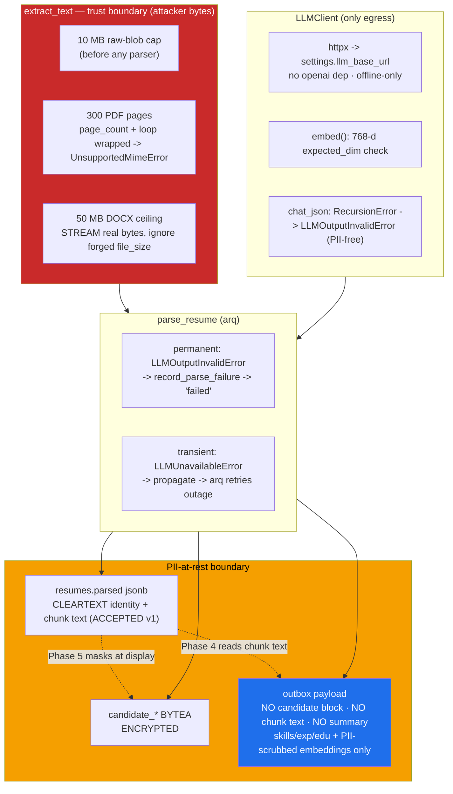

# ADR-007: Phase 3 — Ingest & Parse — Hardening & PII-at-Rest Posture

**Status:** Accepted (extends ADR-005 blob boundary, ADR-006 §4 redaction boundary, ADR-004 embedding contract)
**Date:** 2026-07-11

## Context

Phase 3 ports the résumé/JD **ingest + parse** pipeline from hris (`packages/pipeline/`,
`apps/worker/`) into `core/`: PDF/DOCX/RTF/TXT extraction, deterministic chunking, the
OpenAI-compatible LLM client, the skills scan/merge, and the `parse_resume` arq task that lands a
parsed résumé in Postgres and enqueues a projection event. `extract_text` is the first code to
touch attacker-supplied bytes; `LLMClient` is the only egress; `parse_resume` is where PII is
encrypted at rest and where the outbox event is shaped for Phase 4.

Two merge-blocking security/reviewer audits ran against the port. This ADR records the Phase 3
decisions and — most importantly — the **PII-at-rest boundary**, because it is a deliberate,
non-obvious posture that later phases depend on.

## Decision

### 1. LLM client ported verbatim on `httpx`; the `openai` dependency is dropped

`src/pipeline/llm/client.py` is a behavioral-verbatim port of the hris client, but the `openai`
package is not a dependency: all traffic goes through `httpx` against
`settings.llm_base_url` (the OpenAI-compatible `/v1` surface, or Ollama's native `/api/chat` when
`native_chat=True`). Reliability features are unchanged: exponential backoff with jitter on
5xx/connect/timeout, a circuit breaker, and a `chat_json` self-correction retry. An offline-egress
test asserts the settings-built client only ever points at `host.docker.internal`/`localhost`/
`127.0.0.1` and never at a cloud host.

### 2. The PII key is sourced from settings, not a secrets file

pgcrypto encrypt/decrypt of candidate PII uses a session GUC (`SET LOCAL app.pii_key`) set from
`settings`, in the same transaction as the decrypt (the GUC is transaction-scoped, so `set_pii_key`
runs strictly before `pii.decrypt`). There is no separate secrets-file loader in v1.

### 3. Graph projection is deferred to Phase 4 (`parse → Postgres → outbox`)

`parse_resume` stops at writing `resumes` and enqueuing a `resume.parsed` outbox row. hris's
`project_resume` / `_resume_projection_tx` / `project_to_graph` are **not** ported; the ranking core
stays free of any Neo4j write in Phase 3. Phase 4 consumes the outbox and projects into the graph.

### 4. Skill-dedupe module split; the Neo4j half deferred

The skills path is a deterministic vocabulary scan (always runs, never fails) MERGED with a
best-effort `resume_skills_v2` LLM call. Canonicalization/dedupe against the ontology lives in
`src/pipeline/skills`; the Neo4j-backed ontology half is deferred to Phase 4. `_extract_skills_merged`
is the floor: a résumé still parses names-only when the model fails.

### 5. `jd_extract_v1` is the 5th prompt pair actually needed

The prompt set for Phase 3 is `resume_core_v1`, `resume_skills_v2`, `cover_letter_v1`, and the
JD-extraction pair `jd_extract_v1` — five prompt files, not the larger hris set (the review-workflow
and harmonizer prompts are cut).

### 6. Input-safety caps at the `extract_text` trust boundary (independent of Phase 6 upload cap)

`extract_text` cannot lean on an upload-side cap that does not exist yet (Phase 6), and the worker
runs `max_jobs=4`, so an unbounded parse is four concurrent bombs from taking the box down. Three
caps live at this boundary, each a MAXIMUM (the exact value is accepted):

- **10 MB raw blob**, checked before any parser touches the bytes.
- **300 PDF pages.** The page-count read AND the per-page iteration loop both run MuPDF C code that,
  on a malformed page tree, raises an **untyped** exception outside our caught family — a bare
  `RuntimeError` (`code=7: Invalid number of pages`) from `doc.page_count`, or
  `pymupdf.mupdf.FzErrorFormat` (`cycle in page tree`) from the loop. Both are now wrapped broadly
  into the typed `UnsupportedMimeError` (the page cap's `InputTooLargeError` and the encrypted-PDF
  `EncryptedPdfError` stay distinct and are re-raised, never swallowed), so a malformed PDF surfaces
  as a typed failure instead of escaping `extract_text → parse_resume` uncaught and stranding the
  row behind an arq retry storm. NOTE on the retained `getattr(doc, "page_count", 0)`: it now sits
  *inside* the broad wrap, so it is not a fail-open — `getattr` only suppresses a MISSING attribute
  (real fitz always exposes `page_count`; only the unit-test fake omits it), while a page-count
  property that RAISES propagates through `getattr` and is caught by the broad handler.
- **50 MB DOCX decompression ceiling via STREAMING actual bytes.** The guard does NOT trust the
  zip's self-declared central-directory `file_size` — that field is attacker-controlled and can lie
  (security forged a 50-byte declaration over a 60 MB member; a CD-summing guard passed it, then the
  reader inflated it anyway). Instead each member's declared `file_size` is neutralised to a large
  sentinel (so zipfile's reader cannot be tricked into truncating a member at the forged size and
  CRC-failing) and then streamed via `zf.open()` in bounded 1 MB chunks, summing REAL decompressed
  bytes and raising `InputTooLargeError` the instant the running total crosses the cap — before
  `Document()` sees the bytes and without building any member whole in memory. A huge *number* of
  small members is handled by the same running sum for free.

Two adjacent hardening items land in the same phase: the `LLMClient.embed` **768-d `expected_dim`**
check (sourced from `settings.llm_embedding_dim`) fails a mis-pointed embedding model at the source
instead of at Neo4j write time in Phase 4; and the `chat_json` parse path now catches `RecursionError`
(from `json.loads` OR the bounded `_strip_nuls` walk) on deeply-nested, prompt-injectable JSON and
funnels it into the same PII-free `LLMOutputInvalidError` path as a decode/validation failure, so it
cannot escape `chat_json → parse_resume` uncaught.

### 7. The PII-at-rest boundary (the load-bearing decision)

Candidate identity exists in three places with three different postures:

- **Encrypted at rest — `candidate_*` BYTEA columns.** Name/email/phone are pgcrypto-encrypted
  (`encrypt_pii_via_session`) alongside a search hash. This is the ciphertext home of identity.
- **Cleartext at rest — `resumes.parsed` jsonb — ACCEPTED for v1.** The parsed structure keeps the
  full `candidate` block AND the full chunk text, and résumé header chunks contain the candidate's
  name/email/phone verbatim. This cleartext PII in `resumes.parsed` is **accepted** because
  `resumes.parsed` sits behind the same DB-access boundary as the encrypted columns and is the
  *system of record* Phase 4's evidence-verification stage reads chunk text from; Phase 5 redaction
  handles display-time masking (ADR-006 §4). `resumes.parsed` deliberately KEEPS full chunk text.
- **Cleartext in transit — the `outbox` payload — carries NO candidate identity.** The `resume.parsed`
  event is projected into Neo4j by Phase 4 and needs skills/experience/education +
  embeddings only, NOT identity. The `outbox` is an unencrypted jsonb table, so the payload
  deliberately excludes the structured `candidate` block, raw chunk TEXT
  (`parsed.chunks[].text` / `parsed.cover_letter_chunks[].text`), **and** the cleartext `summary`
  field — dropping the structured block alone was "theatre" while header-chunk text (and a
  name-opening `summary`) still shipped name/email/phone. Chunk `id`/`section`/`page` stay
  (embeddings are keyed by chunk id; Phase 4 reads any text preview and the summary from
  `resumes.parsed`, the system of record).
- **Embeddings are PII-equivalent and are made outbox-safe at the embedding boundary.** `chunk_embs`
  and `summary_emb` are separate top-level payload keys that ride the same unencrypted outbox and are
  projected into a Neo4j vector index in Phase 4, so a `nomic-embed-text` vector of a header chunk (or
  of a summary a small model opened with the candidate's own name) would be PII-equivalent under
  PIPEDA/FIPPA. Every string handed to the embedder is therefore scrubbed by a deterministic
  `_redact_candidate_pii(text, candidate)` pass — each non-empty structured identifier
  (name/email/phone/location) is removed as a whole, case-insensitive literal substring — applied to
  BOTH each chunk's text and the composed summary text before `embed(...)`. This is on TOP of
  `_build_summary_text` (which still never reads the `CandidateInfo` block). Only the embedder's INPUT
  is scrubbed: the chunk text and `summary` STORED in `resumes.parsed` stay full/cleartext at rest
  (system of record). The `resume_core_v1` prompt also instructs the model to keep name/contact out
  of `summary` (defense in depth).

The split, stated plainly: **identity may live at rest behind the DB boundary (encrypted, and
cleartext in `resumes.parsed`); identity must NOT ride the outbox into the graph — not as the
structured block, not as chunk/summary text, and not encoded inside an embedding vector.**

### 7a. Redis backs the embedding cache (accepted deviation from CLAUDE.md's "Redis only as arq broker")

`CachedEmbedder` reads through a Redis `emb:v1:*` keyspace (keyed on `sha256(model\ntext)`, TTL from
`settings.embedding_cache_ttl_s`) on the SAME Redis instance that backs the arq broker, in a distinct
key space. CLAUDE.md says "Redis only as arq broker"; this is a recorded, ratified decision, not
drift — local re-embedding is the pipeline's slowest step, the cache serves partial batch hits, and
the vectors are non-authoritative (Neo4j is the vector system of record). No PII lands in Redis: the
cache keys and values are computed from the already-`_redact_candidate_pii`-scrubbed embedder input.

### 8. Permanent-vs-transient error split in `parse_resume`

A **permanent** per-document failure (`LLMOutputInvalidError` — the core `chat_json`, a
`ResumeParsed` validation error, OR an embedding count/dim mismatch) is funnelled through
`record_parse_failure` → `status='failed'` with a PII-free reason, so arq does not retry an input
that can never succeed. A **transient** `LLMUnavailableError` (Ollama down) is deliberately NOT
caught, so it propagates and arq retries the genuine outage. The embedding calls (summary embed +
the batched chunk embed) are now inside this guard; previously they were unguarded and a permanent
embedding error escaped, stranding the row with a NULL `failure_reason`. (`parse_job` currently
treats a broad `Exception`, incl. `LLMUnavailableError`, as permanent; that inconsistency with
`parse_resume` is accepted for now.)

## Architecture Diagram

## Consequences

- The three `extract_text` caps hold standalone, before any Phase 6 upload cap exists; a decompression
  bomb (truthful or lying-header), a 301-page or malformed PDF, and a >10 MB blob all fail as typed
  errors that `parse_resume` records, never as an uncaught escape + retry storm.
- No cloud egress is reachable from the LLM client, and a mis-pointed embedding model fails at the
  source (dim check) rather than silently producing wrong-width vectors that only blow up at Neo4j
  write time.
- Deeply-nested prompt-injectable JSON can no longer crash the worker via `RecursionError`.
- Phase 4 receives an identity-free projection event; the graph never sees candidate name/email/phone.
  The cost is that `resumes.parsed` holds cleartext identity — accepted, behind the DB boundary, with
  Phase 5 owning display-time redaction (ADR-006 §4).
- **Open item for Phase 4:** it must read chunk-text previews from `resumes.parsed` (the system of
  record), not from the outbox payload, which now carries chunk ids/embeddings only.

## Alternatives Considered

- **Trust the zip central directory's declared decompressed size** (sum `ZipInfo.file_size`):
  rejected — the field is attacker-controlled; a forged small declaration defeats a CD-summing guard
  entirely. Streaming real bytes with the declared size neutralised is the only guard that holds.
- **Special-case the one MuPDF error string** (`"Invalid number of pages"`): rejected — MuPDF raises
  many unrelated, untyped exception types across two code paths (page-count read and page iteration)
  on malformed input; any of them means "unparseable PDF", so a broad `except Exception →
  UnsupportedMimeError` around both is correct, with `InputTooLargeError`/`EncryptedPdfError`
  re-raised distinctly.
- **Strip the candidate block from the outbox but keep chunk text** (round-1 fix): rejected as
  theatre — header chunks carry the same name/email/phone the structured block does, so identity
  still shipped into the unencrypted outbox. Both must be dropped.
- **Treat every `parse_resume` LLM error as permanent** (mirror `parse_job`): rejected for résumés —
  a transient Ollama outage must retry, not burn the document as `failed`; only the permanent
  `LLMOutputInvalidError` becomes a failed row.
