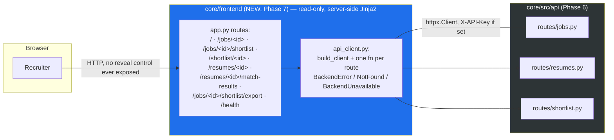

# ADR-013: Phase 7 — Read-Only Flask Viewer, Blind-Only Display, Gate-Scope Widening

**Status:** Accepted (closes ADR-011/012's "minimal Flask viewer" v1-scope item; consumes ADR-012's HTTP
surface as a client for the first time; touches no ranking-scoring code — `stages.py`/`orchestrator.py` are
untouched by this phase)
**Date:** 2026-07-17

## Context

Phase 7 ships the last v1-scope item recorded in `docs/EXTRACTION_PLAN.md`'s locked decisions: "a minimal
web viewer." Every prior phase served the ranking pipeline through direct service calls (Phases 0–5) or
raw HTTP (Phase 6); this is the first phase with a human-facing surface, and the first client of Phase 6's
routes other than a test.

Built on branch `feat/phase-7-evals-viewer`, off `main` @ `e910669` (Phase 6's merge), pre-merge HEAD
`92ca4ae`. Commit chain: `55ee0a0` docs (interim HANDOFF/plan stamp) → `942e8f5` red (failing tests for the
viewer, the api client, and the gate-scope meta-test) → `f28c22e` green (the viewer + client + gate-scope
fix) → `92ca4ae` refactor/fix (post-review findings closed). All three merge-blocking gates were green on
`92ca4ae` (reviewer APPROVE, security PASS, ranking-evals PASS). **MERGED via PR #16 (squash `1039e5c`),
2026-07-17.** Branch `feat/phase-7-evals-viewer` is deleted (local + remote).

The plan's Phase 7 row also named "ranking-quality fixtures (precision@k, evidence-verification rate)" —
see §4 below for why that shipped no new code this phase.

## Decision

### 1. No reveal control in the viewer (v1) — blind-only display

The viewer never sends `reveal` to the backend. `core/frontend/api_client.py::list_shortlist`/
`get_shortlist_entry` take no `reveal` parameter at all, mirroring `shortlist_service.list_for_job`/
`get_one` accepting no such kwarg either — there is structurally nothing to pass. `get_resume`'s `reveal`
keyword defaults to `False`, and the one Flask route that calls it
(`core/frontend/app.py::resume_detail`) hardcodes `reveal=False` and deliberately never reads or forwards
a browser-supplied `?reveal=` query string, so a visitor cannot re-introduce de-anonymization by editing
the URL.

Reveal/reveal-export remains an audited, non-viewer backend surface — `GET /jobs/{id}/shortlist/export`
still accepts `reveal` as a query param at the FastAPI layer (ADR-011/012), and the viewer's own
`shortlist_export` route proxies that endpoint's *default* (`reveal=False`) without exposing a way to flip
it from the browser. Rationale: the viewer must never be able to de-anonymize from the browser — reveal
stays a backend-only, presumably-audited operation. Backed by route tests asserting the viewer's outbound
requests never carry a `reveal=true` (or any `reveal`) parameter on the shortlist paths, and that
`resume_detail` ignores an attacker-supplied query string.

### 2. The blind résumé page is structurally PII-incapable, not merely flag-gated

`resume_detail.html` has no branch that renders `candidate.name`/`candidate.email`/`candidate.phone`/
`candidate.location` at all — the template only ever reads `resume.original_filename`, `resume.status`,
and `resume.id`. This closes a latent path that had been gated only on the backend's `blinded` flag, which
ADR-012 notes had a fail-open history (`JobOut.blind_review` defaulting `False` until Phase 6 closed it).
Even if a future backend regression served an unredacted `ResumeOut` to the viewer, the template itself has
no code path capable of printing the PII fields — this was security finding #1 this phase, folded into the
fix pass (`92ca4ae`).

### 3. Gate-scope widened to cover `frontend/`

`Makefile` (`gates`/`gates-fast`) and `.github/workflows/ci.yml` (`static`/`unit` jobs) are widened so
`ruff check`, `black --check`, `mypy --strict`, and the coverage gate now all run over `core/frontend/`
alongside `core/src` and `core/tests` — previously the frontend directory was invisible to every quality
gate, because it is a sibling of `core/src/` (`core/frontend/`), not nested under it, and every gate
command named `src tests` explicitly. This was necessary because the frontend code (`api_client.py`,
`app.py`, and the tests exercising them) was un-type-checked and uncounted toward coverage from the moment
it existed — a real gap, not a hypothetical one, since Phase 7 is the first phase to write any
`core/frontend/` code. `core/tests/unit/test_gates_cover_frontend.py` (new, a meta-test — reads
`Makefile`/`ci.yml` text and asserts `frontend` appears in every relevant gate invocation) pins this so a
future edit to either file can't silently drop the frontend directory back out of scope.

### 4. The evals workstream was already built — Phase 7 added no new fixtures

The plan's Phase 7 row said "ranking-quality fixtures (precision@k, evidence-verification rate)." Those
already shipped in Phase 4a (`core/tests/evals/` — the labelled corpus, `thresholds.toml`, the harness
stub) and Phase 4c (`run_evals.py`'s live wiring against the real orchestrator, `precision@5 = 1.0`,
`gold_recall = 4/4`, 0 PII leaks). `run_evals.py::main()` already runs inside `pytest tests/unit` (gated,
counted toward the 2229-test/91.67% figure below) as of 4c. Phase 7 built and verified the viewer only —
it added zero new evals fixtures, zero changes to `core/tests/evals/`, and zero changes to `run_evals.py`.
Recording this explicitly so a future reader does not read the plan's Phase 7 row as an open evals gap:
that line item was already satisfied two phases ago.

### 5. Live end-to-end eval — reversed 2026-07-17: built, run, and PASSED

Originally recorded here as deferred (see the superseded text below for the original reasoning). The
human reversed that decision on **2026-07-17**, after PR #16 was opened, and made a live run a
**prerequisite for merging PR #16**. It has since been built (`core/tests/evals/run_evals_live.py`, new,
812 lines) and independently reproduced twice against a real stack — **identical PASS both times, exit
0.**

**Design (faithfulness to the corpus's own contract).** The 4a corpus is pre-parsed by design — 4a fixed
the parsed representation to isolate ranking quality from non-deterministic LLM parsing, so there are no
raw résumé/JD documents in the corpus, only pre-parsed JSON. A literal reading of "upload the corpus
fixtures through Phase 6's HTTP routes" (this section's original wording) is therefore not followed:
re-running the corpus through the LLM parse step would inject parse variance the corpus was deliberately
built to exclude, drifting every calibrated threshold in `thresholds.toml`. Instead, the harness seeds the
pre-parsed corpus at the **post-parse boundary** — a `jobs` row + 20 `resumes` rows with `parsed` jsonb,
PII encrypted via the real `pii.py` path, and `job.parsed`/`resume.parsed` outbox events carrying **real**
`nomic-embed-text` embeddings computed through the production embed boundary (with PII redaction) — then
drives the real `project_to_graph` (Neo4j) → real `shortlist_job` → reads the persisted
`shortlist_entries` rows → evaluates every gate in `thresholds.toml`. It reuses
`run_evals.load_corpus`/`load_thresholds`/`_labels` (no duplication of the corpus-loading logic) and calls
the **real** `stages.verify_evidence` and the **real** redaction functions for the anti-fabrication and PII
gates — not the offline stand-ins `run_evals.py` uses in CI. `project_to_graph`/`shortlist_job` are
invoked directly with a real `ctx` (not enqueued on the arq worker) — identical production task code and
live dependencies, just not routed through Redis. The run used a remote Ollama with the calibrated models
(`nomic-embed-text` + `gpt-oss:20b`); the local metal host lacked them.

**Verified results (reproduced exactly, both runs, exit 0):**

| Gate | Result |
|---|---|
| `precision@5` | 1.000 (top-5 all `strong`) |
| adversarial bait (r09) | ranked 14th, outside k=5 — `must_not_surface`: no offenders |
| `evidence.verification_rate` | 78/78 = 1.000 |
| `evidence.min_completeness_in_topk` | 5/5 = 1.000 |
| `evidence.gold_recall` | 4/4 = 1.000 |
| `evidence.negative_evidence_must_fail` | 4 fabrications, all scrubbed |
| `ordering_controls` | education +0.0411, overqual +0.0120, motivation +0.0900, skill_missing_must +0.1460, recency +0.1440 — all pass |
| `pii.embedding_input_pii_free` | 0 leaks / 20 fixtures |
| `pii.exported_output_pii_free` | 0 leaks / top-5 |
| determinism | order identical, `max_rank_delta=0`, `max_score_delta=0` |

The measured ordering gaps track `labels.json`'s arithmetic predictions against a real embedder closely
(overqual +0.0120 exact match to the arithmetic prediction; education +0.0411 vs the ~0.0391 predicted in
the "4a hardening" round-7 correction, §"N-1" — the residual is the embedder-measured vector component the
prediction always acknowledged as approximate) — evidence the real pipeline reproduces the calibrated
behaviour this corpus's thresholds assume, not just what the offline stand-in reproduces.

**Gate-ability.** The pure metric layer (`eval_*` functions) is offline-unit-tested — `core/tests/unit/test_evals_live_metrics.py`
(new, 16 tests), asserting bad rankings FAIL: weak-in-topk, a fabricated surfaced quote, a dropped gold
anchor, reversed/tied ordering, a PII leak, and score drift. The live orchestration script itself lives
under `core/tests/evals/` (not `core/tests/unit/`, so it is not collected by `pytest tests/unit`) and only
runs as a script against a live stack — CI stays green with no Ollama reachable. The offline suite grew
from 2229 to **2245 unit tests @ 91.67% coverage**; ruff/black/mypy remain clean.

**Deviations and residuals, recorded honestly, not smoothed over:**
- This section's original wording ("uploading the corpus fixtures through Phase 6's HTTP routes") is
  intentionally **not** followed — see "Design" above for why seeding at the post-parse boundary is the
  faithful choice, not a shortcut.
- `project_to_graph`/`shortlist_job` ran with a directly-constructed `ctx`, not dequeued off arq/Redis —
  identical production task code and live dependencies, but the queue hop itself is unexercised by this
  harness.
- The determinism check's second run used a warm Redis embed cache, so the embedding half of the
  determinism comparison is cache-vs-itself, not model-vs-itself on a cold cache; `gpt-oss:20b`'s greedy
  decode is not guaranteed bit-stable across runs, so a nonzero score drift on the generation half would
  have been a real (not artefactual) observation — here it measured exactly zero.
- The `jd.education.fields` open decision (ADR-009 §7, restated through ADR-013) remains **unresolved and
  untouched** by this addition.

**Superseded original text (kept for the historical record of what was decided 2026-07-17 morning, before
the reversal later the same day):** "A live run of the 4a/4c corpus through the real API →
Postgres/Neo4j/Ollama pipeline … was deferred because it needs a reachable host Ollama plus `docker
compose up` and cannot run in CI … Recorded here as a documented follow-up, not built this phase."

### 6. Documentation correction — CI does not call Ollama

Prior HANDOFF/plan text repeatedly said "CI (`gates-all`, incl. a live `run_evals.py` re-measurement
against Ollama)" for Phases 4d/5/6. That phrasing is **inaccurate** and is corrected wherever it appears in
`HANDOFF.md`/`docs/EXTRACTION_PLAN.md` as part of this phase's docs pass: CI runs the offline deterministic
stand-in harness (`run_evals.py::main()`, invoked inside the `pytest tests/unit` gate, using the
`_best_partial_ratio`/stdlib-`SequenceMatcher` stand-in verifier and a mocked embedder — see the 4a
hardening notes in `docs/EXTRACTION_PLAN.md`); it never calls Ollama, by explicit design
(`.github/workflows/ci.yml`'s own comment). What does *not* run in CI is any live measurement against a
real Ollama endpoint — that is exactly what §5's live harness now does, run manually/by a human as a merge
prerequisite (`docker compose … exec -T api python tests/evals/run_evals_live.py` against a stack pointed
at an Ollama with `nomic-embed-text` + `gpt-oss:20b`), never inside CI.

## Architecture Diagram

Note the diagram's absence of a `reveal` edge/label anywhere on the browser-to-viewer leg: this is
deliberate (§1) — the viewer surface is structurally incapable of carrying that parameter from the
browser, not merely configured not to.

## Locked human decisions this phase

1. Blind-only viewer for v1 — no reveal control anywhere in the viewer's UI or query-string handling (§1).
2. Résumé detail page redesigned so the template itself cannot render PII fields, closing a latent
   fail-open path rather than relying solely on the backend's `blinded` flag (§2).
3. Gate scope widened to `core/frontend/` rather than adding a second, separately-tracked gate suite for
   the viewer (§3) — one gate command, one coverage number, one meta-test pinning it.
4. No new evals fixtures this phase — the plan's Phase 7 evals line item was already satisfied by 4a/4c
   (§4).
5. Live end-to-end eval (real API-adjacent pipeline — post-parse-boundary seed → real `project_to_graph` →
   real `shortlist_job` → persisted rows — re-measuring `thresholds.toml`) was recorded here as deferred,
   then **reversed on 2026-07-17**: the human un-deferred it and made it a prerequisite for merging PR #16.
   Built (`run_evals_live.py` + `test_evals_live_metrics.py`), run, and PASSED, reproduced identically
   twice (§5).

## Accepted-for-v1 residuals (non-blocking, recorded not fixed)

- **`_unavailable(exc: BackendUnavailable)` has an unused `exc` parameter.** A reviewer nit, not a
  security finding: after the finding-#2 fix (below), the error page is fully static (`error.html` renders
  no backend-supplied text at all, so the backend URL/error message can never reach the browser), so `exc`'s
  value is no longer rendered. Kept because the signature still documents the handler's intent (it exists
  specifically to handle a `BackendUnavailable`) and ruff's unused-argument rules are not enabled in this
  repo's `pyproject.toml`. Accepted, not fixed.
- **Security finding #2 (unused error `message`) — CLOSED in the fix pass.** An earlier draft of
  `_unavailable` interpolated the raised exception's message into the rendered error page; because that
  message can carry the backend's base URL or a raw `httpx` exception string, it was removed in favor of a
  fully static `error.html` before this phase's HEAD. Not a residual — already fixed.
- **Reverse-match ranking quality is entirely ungated.** The `[reverse_match]` section of `core/tests/evals/thresholds.toml` (lines 414-418) is a commented-out placeholder, so no precision, evidence-verification or ordering bar applies to the résumé→jobs direction, while the forward direction is gated at 100% precision@5. Accepted for v1; revisit before reverse match informs any decision.

## Still-open human decision, carried forward AGAIN — not touched by this phase

`score_education` ignores `jd.education.fields` (ADR-009 §7, restated ADR-010 §5, ADR-011 §"still-open").
Phase 7 touches no scoring code — `stages.py`/`orchestrator.py` are byte-unchanged — so this remains
exactly as open as it was after Phase 6. Either extend the scorer to read `fields`, or drop `fields` from
the JD contract.

## Layout correction

`docs/EXTRACTION_PLAN.md`'s original target-layout sketch (the "Target layout (on the template)" section)
showed the viewer living at `core/src/web/`. The shipped location is `core/frontend/` — a sibling of
`core/src/`, matching the repository layout the README's "Repository layout" section already documented
(`core/frontend/ # Flask viewer (Phase 0: stub)`). This ADR and the plan update record the correction so a
future reader looking for the viewer under `core/src/web/` is redirected to the right place.

## Consequences

- The gate-scope widening (§3) means every future `core/frontend/` change is now type-checked,
  format-checked, and coverage-counted the same way `core/src/` always has been — closing a real gap that
  predated this phase's own code by nothing (the directory existed empty since Phase 0, but held no code
  until now).
- The viewer's blind-only posture (§1/§2) means a recruiter using only the viewer can never see an
  unredacted candidate — reveal remains an audited backend-only capability reachable only by a direct API
  call with the configured `X-API-Key` (or no auth, if `settings.api_key` is unset per ADR-012 §1).
- **Reversed 2026-07-17 (see §5).** The corpus's thresholds have now been checked against a real,
  persisted shortlist row produced by the real `shortlist_job`/`persist_shortlist` path (seeded at the
  post-parse boundary, not through the HTTP upload routes themselves — see §5's "Design" for why). This
  closes the narrow verification gap this bullet originally described for the code paths the live harness
  exercises: `project_to_graph`, `shortlist_job`, `persist_shortlist`, the `ScoreBreakdown` fold/unfold read
  guard (ADR-011 §2), and the real evidence verifier and redaction functions. It does **not** exercise the
  Phase 6 HTTP upload/parse routes themselves (`POST /jobs/{id}/resumes`, `parse_job`/`parse_resume`) or the
  arq/Redis queue hop — those remain covered only by Phase 3/4/6's own unit and integration tests, not by
  this live eval.

## Alternatives Considered

- **Give the viewer a reveal toggle, gated behind the same `X-API-Key`/actor-name mechanism as the
  backend** — rejected for v1: a browser-facing reveal control, even one that requires a key, puts a
  de-anonymization capability one click away from whoever has the viewer open, rather than requiring a
  deliberate direct API call. The backend capability (ADR-011/012) already exists for anyone who needs it;
  the viewer does not need to re-expose it.
- **Gate `core/frontend/` with a second, separate `make gates-frontend` target instead of widening the
  existing `gates`/`gates-fast`** — rejected: a second target is exactly the kind of thing a future
  contributor forgets to run, and CI would need a second job wired to it. Widening the existing targets
  means the frontend is covered by construction, and the meta-test (§3) pins it against silent regression
  the same way router-level auth dependencies were chosen over per-route ones in ADR-012 §1's "Alternatives
  Considered."
- **Build the live end-to-end eval now, inside this phase** — originally rejected/deferred (§5): it
  requires a reachable host Ollama and a running `docker compose up` stack, neither of which CI provides by
  design, and building it without being able to gate it in CI would leave an unverifiable manual script
  rather than a real gate. **Reversed 2026-07-17** — see §5: the human decided the manual, non-CI script is
  still worth building and running as a merge prerequisite for PR #16, precisely because CI's offline
  `run_evals.py` stand-in cannot verify the real HTTP-adjacent/Postgres/Neo4j/Ollama path at all. Built as
  a script under `core/tests/evals/` (not collected by `pytest tests/unit`) so CI's gate posture is
  unchanged; its pure-metric layer is separately unit-tested so it isn't wholly outside the gated suite.
- **Keep the résumé template's PII-rendering code but gate it purely on the backend's `blinded` flag** —
  rejected (§2): ADR-012 already documents that `JobOut.blind_review`'s fail-open history was a real
  historical bug (closed in Phase 6, but real). Relying on a single upstream flag for the viewer's own
  last line of defense repeats that class of risk; removing the rendering code entirely closes the class
  by construction, the same reasoning ADR-008 used for the skill-graph PII rearchitecture.
