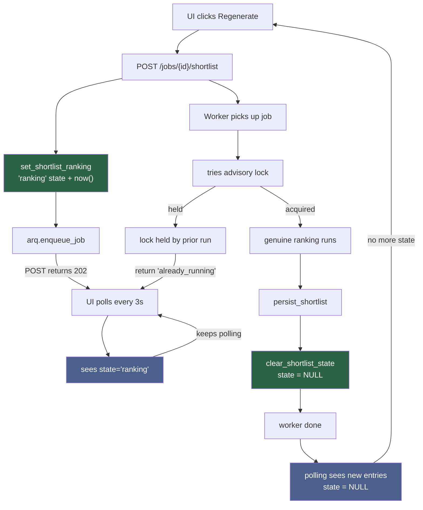

# ADR-043: Shortlist regeneration polling gate — record 'ranking' state server-side

**Status:** Accepted — implements the UI fix for regenerate shortlist not updating (`fix/regenerate-shortlist-no-feedback`)
**Date:** 2026-08-18

## Context

The defect, measured on the live running stack: when a recruiter clicks "Regenerate shortlist" on a job that already has a previous shortlist, the API accepts the request (HTTP 202), the worker runs to completion (indices show fresh rows with a matching `generated_at` timestamp), and the database persists correctly — but the UI never updates to show the new ranking. The shortlist cards stay locked on the previous result, and the polling indicator stops within seconds, never recovering.

Root cause: the frontend polling logic (`shortlist_cards.html:14`, pre-fix) infers "a run is in flight" from the condition `not entries`. This is correct for a first "Generate" (no prior entries) but wrong for "Regenerate" — entries already exist from the previous run, so the poll-gate fires `False` and stops immediately, even though a real ranking run is minutes underway.

This is an invisible defect from the test suite's perspective. Every test validates that:
- The POST returns 202 ✓
- The worker enqueues and runs ✓
- New rows are written with a fresh `generated_at` ✓
- `shortlist_entries` receives the correct data ✓

None of these prove the polling gate works. The defect only surfaces by:
1. Running `quickstart.ps1` to boot the real stack
2. Clicking through the live UI manually
3. Uploading résumés
4. Clicking "Generate" and watching the shortlist appear
5. Clicking "Regenerate" — nothing happens on the screen

This matches the repository's characteristic A7 finding: the invariant ("a run in flight, recorded as a fact rather than inferred from emptiness") was true in code but live-enforced nowhere — not in tests, not in the UI until the click proved it false.

## Decision

Record the fact server-side: write `jobs.shortlist_state = 'ranking'` from the API route **before** it enqueues the job, so the state is already true the instant the POST returns and the frontend's very first poll sees it. The worker clears or overwrites it on every terminal path EXCEPT `already_running` (success, empty, not_parsed, missing clear it; the fail-closed path overwrites it with `awaiting_llm`). `already_running` deliberately leaves it set — see the terminal-path table below. The frontend polls based on two flags now: `(not entries) or ranking or awaiting_llm`, each answering a different question.

### 1. Schema — the widened CHECK constraint

`jobs.shortlist_state` originally shipped with `CHECK (shortlist_state IN ('awaiting_llm'))` for ADR-029. This branch widens it to allow both values:

```sql
ALTER TABLE jobs DROP CONSTRAINT IF EXISTS jobs_shortlist_state_check
ALTER TABLE jobs ADD CONSTRAINT jobs_shortlist_state_check 
    CHECK (shortlist_state IN ('awaiting_llm', 'ranking'))
```

**Constraint name confirmed live:** the auto-generated name from the original inline `CHECK` was confirmed against the running dev Postgres stack to be `jobs_shortlist_state_check`, and a test pins it (`test_shortlist_ranking_state_pg.py::test_generate_shortlist_route_sets_ranking_state_before_worker_runs`). The DDL pair is unconditionally re-run on every boot (naturally idempotent: `DROP IF EXISTS` + `ADD` together = no-op once widened).

### 2. Service functions — add and clear the state

Three functions live in `shortlist_service.py` (lines 224-237):

```python
async def set_shortlist_ranking(conn: DbConn, job_id: UUID) -> None
async def clear_shortlist_state(conn: DbConn, job_id: UUID) -> None
async def get_shortlist_state(conn: DbConn, job_id: UUID, *, user_id: UUID | None = None) -> ShortlistStateOut | None
```

`set_shortlist_ranking` records the state with a `now()` timestamp; `get_shortlist_state` was added in ADR-029 and already reads it. A test covers the route's own write (`test_generate_shortlist_route_sets_ranking_state_before_worker_runs`); four worker tests cover the clear path on every terminal outcome.

### 3. API route — set state before enqueue

`POST /jobs/{job_id}/shortlist` calls `await shortlist_service.set_shortlist_ranking(db, job_id)` at line 62 of `routes/shortlist.py`, synchronously, **before** `arq.enqueue_job`. The response is `202 Accepted` with `{"job_id": "...", "status": "enqueued"}`. From the frontend's first poll onward, the state is already true.

### 4. Worker — clear state on every terminal path

`shortlist_job` in `matching_tasks.py` clears or overwrites the state on all paths:
- **`"persisted"` / `"empty"`** (success): clears via `clear_shortlist_state` in the same transaction as the write (lines 156-160)
- **`"not_parsed"` / `"missing"`** (precondition failure): clears synchronously (lines 104, 111)
- **`"already_running"`** (advisory lock held by concurrent duplicate): **deliberately leaves the state set** — the other run owns the lock and is genuinely ranking, so clearing would blank the UI mid-run (lines 81-87)
- **`"awaiting_llm"` at ceiling** (fail-closed, retry exhausted): overwrites `'ranking'` with `'awaiting_llm'` and reason + timestamp (line 139)

The `finally` at line 161 releases the advisory lock before any `Retry` propagates, so the re-run can re-acquire it cleanly.

### 5. Frontend — poll on two flags, not one

`shortlist_cards.html` (lines 18-39) defines:

```jinja



```

Two separate conditions, kept distinct:
- **`ranking`** — a run genuinely in flight right now (set by route at enqueue, overwritten/cleared by worker)
- **`awaiting_llm`** — a prior run failed closed with a retry queued (set by worker on LLM failure, cleared on next success)

Both trigger polling. Each renders a distinct banner (lines 46-91):
- `ranking + entries` — "previous run displayed; new run in progress"
- `awaiting_llm + entries` — "previous run displayed; retry queued, no action needed"
- `awaiting_llm` alone (no entries yet) — "retry queued, no results to show yet"
- nothing (no entries, no state) — "Click Generate"

### 6. Staleness bound — crashed-worker backstop

`get_shortlist_state` (lines 276-279 of `shortlist_service.py`) reads back a `'ranking'` row as "not ranking" if its `shortlist_state_at` is older than `settings.shortlist_ranking_stale_after_s` (default 3600s, one hour). A worker that dies mid-run has a `job_timeout` of its own, so a two-hour-old `'ranking'` row cannot still be genuinely in flight. The row is left untouched (reported as not-ranking, never silently cleared), but the UI stops polling instead of being permanently pinned on "Regenerating…".

### 7. The unchanged flag — `awaiting_llm` and `ranking` are deliberate twins

Both flags live in the same columns but answer different questions:
- `ranking` — "is a run happening right now?"
- `awaiting_llm` — "did a run just fail, with a retry queued?"

A successful run clears `awaiting_llm` (erases the prior failure), overwriting it the instant the write commits. A failed run overwrites `ranking` with `awaiting_llm` (same row, different state). Do not collapse these into one flag — they drive distinct banners, and the wrong message on a UI reveals a state-machine bug in production.

## Consequences

- A recruiter clicking "Regenerate" now sees immediate feedback: "previous run displayed, new run in progress" within milliseconds of the click (the latency of the first poll, not the ranking duration)
- The first poll already sees the state true, so no race condition between enqueue and the first fetch
- On a second "Regenerate" during an in-flight first run, the advisory lock held by the first run rejects the second (already_running), the state stays set to the first run's 'ranking', and the UI continues showing the correct message
- If a worker crashes mid-run, the staleness bound prevents permanent UI pinning; after one hour of no update, polling stops even if the row was never cleared

## Honesty section — what this change does NOT do

- **Ranking quality is completely unchanged.** This records a UI state fact; no scoring, weight, sub-score or corpus change.
- **The `reverse_match_job` task is deliberately left alone** (`matching_tasks.py` lines 176-181). It has no state column of its own (state is keyed on `jobs`, not on `resumes`), no equivalent "regenerate shows a stale list" defect was reported, and it relies solely on the advisory lock for in-flight detection. Widening the fix is out of scope.
- **A second Regenerate during a run is dropped by the advisory lock, not acknowledged.** The duplicated request's response is still `202 Accepted`, but the worker returns `"already_running"` and does nothing. The UI keeps polling the existing state. A user clicking twice gets no error or indication that the second click was ignored — this is deliberate (the lock holds across both runs), but it is a residual user-facing gap worth naming. It is acceptable because a real recruiter workflow does not click "Regenerate" twice per second; a production fix would add a route-level guard or UI-level disable, deferred as out-of-scope polish.

## Accepted residuals

- **No reverse-match equivalent.** Reverse match (candidate → jobs) has no state column and no UI state tracking. The advisory lock alone prevents concurrent runs. Worth adding if reverse-match regeneration becomes a user-driven feature (it is not today).
- **Already_running' leaves 'ranking' set while the lock is held.** If the lock is held for an unexpectedly long time (network partition, stalled Postgres, etc.), the UI will show "a run is in progress" for longer than truthful. The lock's own timeout and the staleness bound are the backstops; this is a monitoring/alerting residual, not a code one.
- **The staleness bound is measured in wall time, not job time.** A job with a 2-hour runtime would read as stale after 1 hour, even if it is still running on a slow LLM peer. The bound is set deliberately short to guard against silent worker death; a genuinely slow rank (2+ hours) would need the staleness bound raised in settings or a job-specific heartbeat mechanism — both future work.

## Alternatives Considered

- **Infer the state from shortlist_entries' `generated_at`.** Rejected — if the worker crashes after writing one row but before committing the transaction, the latest `generated_at` is stale even though a run is re-queued (the row predates the crash and the re-queue). Inference is fragile; recording the fact is stronger.
- **Use a separate table for run state instead of columns on `jobs`.** Rejected — would complicate the advisory lock (which keys on `jobs.id`) and the row-scoping logic (ADR-020 §3, which reads `jobs` directly). The four-column set (`shortlist_state` + reason + timestamp + staleness context) is a light addition to an existing table.
- **Poll more aggressively (e.g. every 0.5s instead of 3s) to reduce perceived latency.** Rejected — the defect is binary (polling vs. not polling), not about frequency. Increasing frequency adds load without fixing the gate.
- **Clear `'ranking'` on exceptions inside the worker.** Rejected — the `finally` releases the advisory lock before any exception propagates. An unexpected exception (not caught as `RankingUnavailableError`) leaves `'ranking'` set, which is backstopped by the staleness bound rather than cleared silently. Silent mutation of the record risks hiding real bugs.

## Verification

- The DDL widened constraint is tested live against real Postgres (`test_shortlist_ranking_state_pg.py::test_generate_shortlist_route_sets_ranking_state_before_worker_runs`) — it proves the widened CHECK accepts `'ranking'` end to end
- The route's write is tested before enqueue (`test_generate_shortlist_route_sets_ranking_state_before_worker_runs`)
- The worker's clear path is tested on all terminal outcomes:
  - `test_shortlist_job_clears_ranking_state_on_persisted`
  - `test_shortlist_job_clears_ranking_state_on_empty`
  - `test_shortlist_job_clears_ranking_state_on_not_parsed`
  - `test_shortlist_job_missing_row_does_not_raise_while_clearing_state`
- The already_running path is tested to leave state unchanged (`test_shortlist_job_leaves_ranking_state_set_on_already_running`)
- The fail-closed path is tested to overwrite 'ranking' with 'awaiting_llm' (`test_shortlist_job_awaiting_llm_path_overwrites_ranking_not_leaves_it`)
- The staleness bound is tested:
  - `test_get_shortlist_state_reports_a_stale_ranking_row_as_not_ranking`
  - `test_get_shortlist_state_reports_a_fresh_ranking_row_as_ranking`

All tests pass against real Postgres, testcontainers integration suite.

## Architecture Diagram (Mermaid)



## Cross-references

ADR-029 (the fail-closed `awaiting_llm` flag this state twin is paired with); ADR-020 §3 (row-scoping that the state route inherits); ADR-010 §1 (the advisory lock the state works alongside); test file `test_shortlist_ranking_state_pg.py` (six integration tests against real Postgres proving the state's behavior); DDL lines 135-149 (the constraint widening); `routes/shortlist.py` line 57-64 (the route); `matching_tasks.py` lines 73-170 (the worker); `shortlist_service.py` lines 173-284 (the state functions); `shortlist_cards.html` lines 14-91 (the frontend rendering).
