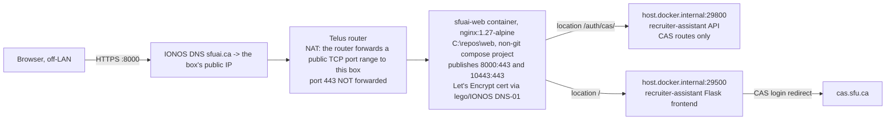

# Runbook — serving the pilot box behind TLS at sfuai.ca

Public URL is **`https://sfuai.ca:8000`** until a router change (last section)
drops the port. This is a runbook, not an essay — steps and verification only.

## Topology



Two separate `docker compose` projects on the same box: this repo's
(`C:\repos\recruiter-assistant`) and the non-git nginx project
(`C:\repos\web`). Nginx is the only thing with a published port reachable from
the internet; the app ports are published on the LAN interface too (see
Residuals).

## nginx config — `C:\repos\web\nginx\default.conf`

Full file content after cutover — this is the EXACT deployed file
(`C:\repos\web\nginx\default.conf`), not a paraphrase:

```nginx
# sfuai.ca — reverse proxy to the recruiter assistant (cutover 2026-09-15).
# Runbook: C:\repos\recruiter-assistant\docs\deploy\sfuai-ca.md
# Revert to the placeholder site: replace `location /` with
#   try_files $uri $uri/ =404;
# and drop the /auth/cas/ block. Nothing else changes.
server {
    listen 443 ssl;
    listen [::]:443 ssl;
    http2 on;
    server_tokens off;
    server_name sfuai.ca www.sfuai.ca;

    ssl_certificate     /etc/nginx/certs/fullchain.pem;
    ssl_certificate_key /etc/nginx/certs/privkey.pem;
    ssl_protocols TLSv1.2 TLSv1.3;
    ssl_prefer_server_ciphers off;
    ssl_session_cache shared:SSL:10m;
    ssl_session_timeout 1d;

    add_header X-Content-Type-Options nosniff always;
    add_header X-Frame-Options SAMEORIGIN always;
    add_header Referrer-Policy strict-origin-when-cross-origin always;

    root /usr/share/nginx/html;
    index index.html;

    # Above the Flask BFF's own 210 MiB MAX_CONTENT_LENGTH so the app's 413
    # is the one a recruiter sees, not an opaque nginx one.
    client_max_body_size 220m;
    client_body_timeout  300s;

    # Container healthcheck. Deliberately shadows the app so a CAS-gated
    # frontend cannot fail it.
    location = /health {
        default_type text/plain;
        return 200 "ok\n";
    }

    # The CAS ticket dance is owned by the FastAPI backend (ADR-019 §10) and
    # must be reachable by the BROWSER at this public origin. ONLY this prefix
    # is proxied to the API: /docs, /openapi.json and every data route stay
    # unreachable from the internet.
    location /auth/cas/ {
        proxy_pass http://host.docker.internal:29800;
        proxy_http_version 1.1;
        proxy_set_header Host              $server_name;
        proxy_set_header X-Real-IP         $remote_addr;
        proxy_set_header X-Forwarded-For   $proxy_add_x_forwarded_for;
        proxy_set_header X-Forwarded-Proto https;
        proxy_set_header X-Forwarded-Host  "sfuai.ca:8000";
        proxy_set_header X-Forwarded-Port  $server_port;
        proxy_connect_timeout 10s;
        proxy_read_timeout    120s;
        proxy_send_timeout    120s;
    }

    location / {
        proxy_pass http://host.docker.internal:29500;
        proxy_http_version 1.1;
        proxy_set_header Host              $server_name;
        proxy_set_header X-Real-IP         $remote_addr;
        proxy_set_header X-Forwarded-For   $proxy_add_x_forwarded_for;
        proxy_set_header X-Forwarded-Proto https;
        # $http_host keeps the :8000 the browser used, so Flask's host_url
        # (behind ProxyFix) equals the browser's Origin for the CSRF check.
        proxy_set_header X-Forwarded-Host  "sfuai.ca:8000";
        proxy_set_header X-Forwarded-Port  $server_port;
        proxy_connect_timeout 10s;
        # No browser request runs a model synchronously; 300s covers a
        # 210 MiB bulk upload.
        proxy_read_timeout    300s;
        proxy_send_timeout    300s;
        proxy_buffering       off;
    }

    error_page 404 /404.html;
    location = /404.html { internal; }

    access_log /var/log/nginx/access.log;
    error_log  /var/log/nginx/error.log warn;
}

# Catch-all: any request whose Host/SNI is not sfuai.ca is dropped without a
# response. A forged Host header must never reach the app (review 2026-09-15:
# it reached the Werkzeug debugger console through the proxy).
server {
    listen 443 ssl default_server;
    listen [::]:443 ssl default_server;
    server_name _;
    ssl_certificate     /etc/nginx/certs/fullchain.pem;
    ssl_certificate_key /etc/nginx/certs/privkey.pem;
    return 444;
}
```

Only `/auth/cas/` is proxied to the API — `/docs`, `/openapi.json` and every
data route on :29800 stay unreachable from the internet (as of 2026-09-15
they are also refused by the app itself when `CAS_ENABLED=true` — see L1 in
`core/src/api/main.py`). `X-Forwarded-Host` is the **literal string**
`"sfuai.ca:8000"`, not `$http_host` — that is what makes a client-supplied
`Host` header unable to survive to Flask, not "set, not appended" on its own
(nginx's own `Host` header sent upstream is still `$server_name`, likewise
fixed). The real backstop against a forged `Host`/SNI is the default-deny
catch-all `server { server_name _; return 444; }` block above: any request
that doesn't match `sfuai.ca`/`www.sfuai.ca` at the TLS layer never reaches a
`location` block at all.

**Do not enable `CAS_SERVICE_FROM_REQUEST` with this config.** The literal
`X-Forwarded-Host` here means the app already gets a fixed, non-spoofable
value for the CAS service URL; deriving it from the request instead would
throw that guarantee away for no benefit under this nginx config.

The frontend itself runs `flask ... --reload --no-debugger` (see
`docker-compose.yml`) — `--no-debugger` disables the Werkzeug interactive
console. **This is the load-bearing fix for the debugger exposure**; the
catch-all above is what stops a forged-`Host` request from reaching the app
at all in the first place, and the two together are defence in depth — the
catch-all addresses Host injection, not the debugger itself, and
`--no-debugger` addresses the debugger, not Host injection.

Revert `location /`:

```nginx
    location / {
        root /usr/share/nginx/html;
        try_files $uri $uri/ =404;
    }
```

No HTTP→HTTPS redirect is possible — port 80 is not forwarded by the router.

## `C:\repos\web\docker-compose.yml` — ports addition

Add a second published port alongside the existing `10443:443`:

```yaml
services:
  sfuai-web:
    ports:
      - "10443:443"
      - "8000:443"
```

## `.env` keys (this repo, `C:\repos\recruiter-assistant\.env`)

Values only, no secrets:

| Key | Value |
|---|---|
| `LLM_TIMEOUT_S` | `900` |
| `CAS_ENABLED` | `true` |
| `CAS_SERVICE_BASE_URL` | `https://sfuai.ca:8000` |
| `CAS_FRONTEND_BASE_URL` | `https://sfuai.ca:8000` |
| `SESSION_COOKIE_SECURE` | `true` |
| `TRUST_PROXY_HEADERS` | `true` |

`PROXY_HOPS` stays at its default of `1` (one proxy hop: nginx).

## Cutover steps

1. Edit `.env` in this repo with the six keys above.
2. Delete the untracked `docker-compose.override.yml` (it forced CAS off);
   move it to the scratchpad if it needs to be kept for reference.
3. Recreate this repo's stack (not a restart — the env changed):
   ```
   docker compose up -d
   ```
4. Edit `C:\repos\web\nginx\default.conf` to the content above and
   `C:\repos\web\docker-compose.yml` to add the `8000:443` port.
5. Bring the nginx project up:
   ```
   cd C:\repos\web
   docker compose up -d
   ```
6. Verify from the box (hairpin NAT blocks the public IP from inside, so
   `--resolve` to loopback):
   ```
   curl -sS -i --resolve sfuai.ca:8000:127.0.0.1 https://sfuai.ca:8000/
   ```
   Expected: `302` with `Location: https://sfuai.ca:8000/auth/cas/login?next=%2F`
   ```
   curl -sS -i --resolve sfuai.ca:8000:127.0.0.1 "https://sfuai.ca:8000/auth/cas/login?next=%2F"
   ```
   Expected: `302` with
   `Location: https://cas.sfu.ca/cas/login?service=https%3A%2F%2Fsfuai.ca%3A8000%2Fauth%2Fcas%2Fvalidate%3Fnext%3D%252F`
   ```
   curl -sS -i --resolve sfuai.ca:8000:127.0.0.1 https://sfuai.ca:8000/health
   ```
   Expected: `200 ok`
   ```
   curl -sS -k --resolve sfuai.ca:8000:127.0.0.1 -H "Host: evil.localhost" https://sfuai.ca:8000/console
   ```
   Expected: no HTTP response at all — the connection is closed (the
   default-deny catch-all `server_name _` block returns `444`). Compare
   against the honest-host request:
   ```
   curl -sS -k --resolve sfuai.ca:8000:127.0.0.1 "https://sfuai.ca:8000/?__debugger__=yes&cmd=resource&f=debugger.js"
   ```
   Expected: `302` to CAS, **never `200`**. `/console` proves nothing here —
   the Werkzeug debugger middleware sits OUTSIDE Flask's own routing (it
   wraps the WSGI app before any URL rule, including the CAS gate), so a
   `404`/`403` on `/console` only shows that path isn't a real Flask route,
   not that the debugger itself is off. The `__debugger__=yes` resource
   request is the actual debugger entry point; getting a CAS redirect instead
   of the debugger's `debugger.js` is what proves `--no-debugger` (below) is
   doing its job. **`--no-debugger` is the load-bearing fix here** — the
   `444` catch-all above addresses Host injection, a separate exposure, not
   this one.
7. Run `./scripts/doctor.sh`. Expected: the `deploy.auth_disabled` finding is
   gone.
8. `smoke.sh` cannot run on this box any more (it requires CAS off and fails
   rather than skips when CAS is on). The obligation is `doctor.sh` (step 7)
   plus a by-hand drive **from off the LAN** (phone on cellular, not Wi-Fi —
   hairpin NAT means an on-LAN client cannot reach the public IP): CAS login
   as a real principal, land on the jobs list, make one real write and
   confirm it does not 403.

## Revert steps

1. In `C:\repos\web\nginx\default.conf`, restore `location /` to
   `try_files $uri $uri/ =404;` (drop the two `proxy_pass` blocks; keep
   `location = /health`).
2. `cd C:\repos\web && docker compose up -d` to apply.
3. Optionally drop the `8000:443` port line from
   `C:\repos\web\docker-compose.yml` and reapply — the NAT rule still forwards
   8000 but nothing will be listening if the port is also removed here.
4. This repo's `.env`/CAS state is independent of the revert — reverting the
   proxy does not by itself turn CAS back off.

## If SFU CAS rejects the service URL

If CAS enforces an allowlist of registered service URLs, step 6's second curl
will come back with a CAS error page instead of a login form. That is not
fixable from this box — SFU IT Services must register
`https://sfuai.ca:8000/auth/cas/validate` (and later the port-less form, once
443 is forwarded) as an allowed service.

## Dropping the `:8000` port later

Add a router NAT rule forwarding public `TCP 443` to this box's `10443` (the existing
`10443:443` publish already serves the same cert and would-be `location /`
config). Once that rule exists, `CAS_SERVICE_BASE_URL` and
`CAS_FRONTEND_BASE_URL` drop the `:8000` suffix and nothing else changes —
the `8000:443` publish and its NAT rule can then be removed.

## Residuals (recorded, not fixed here — see `docs/ROADMAP.md` §5)

- Any SFU CAS user can authenticate; a first login by anyone other than the
  default admin creates a `users` row with role `NULL` (unbounded, NetID
  only) and lands on `pending_access.html`.
- `:29500` and `:29800` stay published on `0.0.0.0` (the nginx container
  reaches them via `host.docker.internal`, which needs the host publish) —
  the API's `/docs` is reachable on the LAN port, by anything on the LAN.
  (As of 2026-09-15 the app itself also refuses to serve `/docs` at all when
  `CAS_ENABLED=true`, independent of this residual — see L1 in
  `core/src/api/main.py`.)
- `sessions.ip` records the nginx container's address, not the real client
  IP — uvicorn is deliberately not given `--proxy-headers`, because with
  `:29800` also reachable directly on the LAN, trusting `X-Forwarded-For`
  there would let a LAN peer poison `sessions.ip`.
- After cutover, the bare LAN frontend address is a dead end for a human:
  CAS_FRONTEND_BASE_URL is now the public `https://sfuai.ca:8000`, so any
  login started from the bare LAN address redirects the browser to the
  public host anyway. It stays reachable (see the `:29500`/`:29800` residual
  above) but is no longer a usable entry point on its own.
