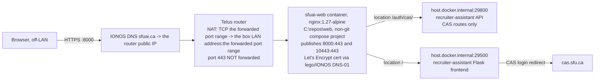

# Runbook — serving the pilot box behind TLS at sfuai.ca

Public URL is **`https://sfuai.ca:8000`** until a router change (last section)
drops the port. This is a runbook, not an essay — steps and verification only.

## Topology



Two separate `docker compose` projects on the same box: this repo's
(`C:\repos\recruiter-assistant`) and the non-git nginx project
(`C:\repos\web`). Nginx is the only thing with a published port reachable from
the internet; the API and frontend stay on `host.docker.internal` and are also
reachable on the LAN (see Residuals).

## nginx config — `C:\repos\web\nginx\default.conf`

Full file content after cutover:

```nginx
server {
    listen 443 ssl;
    listen [::]:443 ssl;
    server_name sfuai.ca www.sfuai.ca;

    ssl_certificate     /etc/nginx/certs/sfuai.ca.crt;
    ssl_certificate_key /etc/nginx/certs/sfuai.ca.key;

    client_max_body_size 220m;
    proxy_read_timeout 300s;
    proxy_buffering off;

    location = /health {
        # container healthcheck target — unchanged
        return 200 "ok";
        add_header Content-Type text/plain;
    }

    location /auth/cas/ {
        proxy_pass http://host.docker.internal:29800;
        proxy_set_header Host $host;
        proxy_set_header X-Forwarded-Proto https;
        proxy_set_header X-Forwarded-Host $http_host;
        proxy_set_header X-Forwarded-For $proxy_add_x_forwarded_for;
        proxy_set_header X-Forwarded-Port $server_port;
    }

    location / {
        proxy_pass http://host.docker.internal:29500;
        proxy_set_header Host $host;
        proxy_set_header X-Forwarded-Proto https;
        proxy_set_header X-Forwarded-Host $http_host;
        proxy_set_header X-Forwarded-For $proxy_add_x_forwarded_for;
        proxy_set_header X-Forwarded-Port $server_port;
    }
}
```

Only `/auth/cas/` is proxied to the API — `/docs`, `/openapi.json` and every
data route on :29800 stay unreachable from the internet. Headers are **set**,
not appended, so `$http_host` still carries `:8000` and Flask's `host_url`
matches the browser's `Origin` for `csrf.same_origin`.

Revert `location /`:

```nginx
    location / {
        root /usr/share/nginx/html;
        try_files $uri $uri/ =404;
    }
```

No HTTP→HTTPS redirect is possible — port 80 is not forwarded by the router.

## `C:\repos\web\docker-compose.yml` — ports addition

Add a second published port alongside the existing `10443:443`:

```yaml
services:
  sfuai-web:
    ports:
      - "10443:443"
      - "8000:443"
```

## `.env` keys (this repo, `C:\repos\recruiter-assistant\.env`)

Values only, no secrets:

| Key | Value |
|---|---|
| `LLM_TIMEOUT_S` | `900` |
| `CAS_ENABLED` | `true` |
| `CAS_SERVICE_BASE_URL` | `https://sfuai.ca:8000` |
| `CAS_FRONTEND_BASE_URL` | `https://sfuai.ca:8000` |
| `SESSION_COOKIE_SECURE` | `true` |
| `TRUST_PROXY_HEADERS` | `true` |

`PROXY_HOPS` stays at its default of `1` (one proxy hop: nginx).

## Cutover steps

1. Edit `.env` in this repo with the six keys above.
2. Delete the untracked `docker-compose.override.yml` (it forced CAS off);
   move it to the scratchpad if it needs to be kept for reference.
3. Recreate this repo's stack (not a restart — the env changed):
   ```
   docker compose up -d
   ```
4. Edit `C:\repos\web\nginx\default.conf` to the content above and
   `C:\repos\web\docker-compose.yml` to add the `8000:443` port.
5. Bring the nginx project up:
   ```
   cd C:\repos\web
   docker compose up -d
   ```
6. Verify from the box (hairpin NAT blocks the public IP from inside, so
   `--resolve` to loopback):
   ```
   curl -sS -i --resolve sfuai.ca:8000:127.0.0.1 https://sfuai.ca:8000/
   ```
   Expected: `302` with `Location: https://sfuai.ca:8000/auth/cas/login?next=%2F`
   ```
   curl -sS -i --resolve sfuai.ca:8000:127.0.0.1 "https://sfuai.ca:8000/auth/cas/login?next=%2F"
   ```
   Expected: `302` with
   `Location: https://cas.sfu.ca/cas/login?service=https%3A%2F%2Fsfuai.ca%3A8000%2Fauth%2Fcas%2Fvalidate%3Fnext%3D%252F`
   ```
   curl -sS -i --resolve sfuai.ca:8000:127.0.0.1 https://sfuai.ca:8000/health
   ```
   Expected: `200 ok`
7. Run `./scripts/doctor.sh`. Expected: the `deploy.auth_disabled` finding is
   gone.
8. `smoke.sh` cannot run on this box any more (it requires CAS off and fails
   rather than skips when CAS is on). The obligation is `doctor.sh` (step 7)
   plus a by-hand drive **from off the LAN** (phone on cellular, not Wi-Fi —
   hairpin NAT means an on-LAN client cannot reach the public IP): CAS login
   as a real principal, land on the jobs list, make one real write and
   confirm it does not 403.

## Revert steps

1. In `C:\repos\web\nginx\default.conf`, restore `location /` to
   `try_files $uri $uri/ =404;` (drop the two `proxy_pass` blocks; keep
   `location = /health`).
2. `cd C:\repos\web && docker compose up -d` to apply.
3. Optionally drop the `8000:443` port line from
   `C:\repos\web\docker-compose.yml` and reapply — the NAT rule still forwards
   8000 but nothing will be listening if the port is also removed here.
4. This repo's `.env`/CAS state is independent of the revert — reverting the
   proxy does not by itself turn CAS back off.

## If SFU CAS rejects the service URL

If CAS enforces an allowlist of registered service URLs, step 6's second curl
will come back with a CAS error page instead of a login form. That is not
fixable from this box — SFU IT Services must register
`https://sfuai.ca:8000/auth/cas/validate` (and later the port-less form, once
443 is forwarded) as an allowed service.

## Dropping the `:8000` port later

Add a router NAT rule `TCP 443 -> the box LAN address:10443` (the existing
`10443:443` publish already serves the same cert and would-be `location /`
config). Once that rule exists, `CAS_SERVICE_BASE_URL` and
`CAS_FRONTEND_BASE_URL` drop the `:8000` suffix and nothing else changes —
the `8000:443` publish and its NAT rule can then be removed.

## Residuals (recorded, not fixed here — see `docs/ROADMAP.md` §5)

- Any SFU CAS user can authenticate; a first login by anyone other than the
  default admin creates a `users` row with role `NULL` (unbounded, NetID
  only) and lands on `pending_access.html`.
- `:29500` and `:29800` stay published on `0.0.0.0` (the nginx container
  reaches them via `host.docker.internal`, which needs the host publish) —
  `http://the box LAN address:29800/docs` is readable by anything on the LAN.
- `sessions.ip` records the nginx container's address, not the real client
  IP — uvicorn is deliberately not given `--proxy-headers`, because with
  `:29800` also reachable directly on the LAN, trusting `X-Forwarded-For`
  there would let a LAN peer poison `sessions.ip`.
