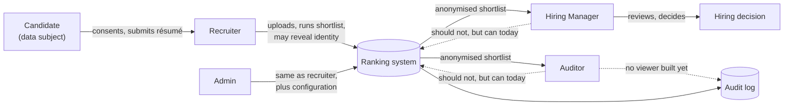
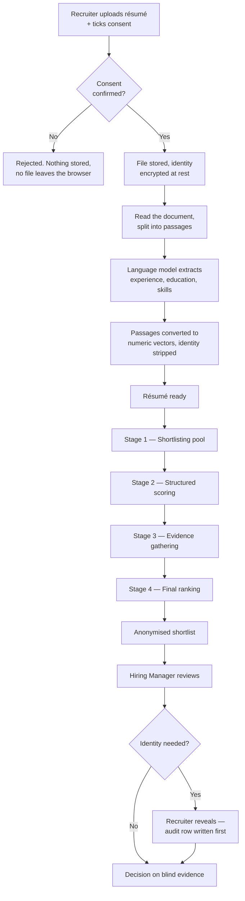
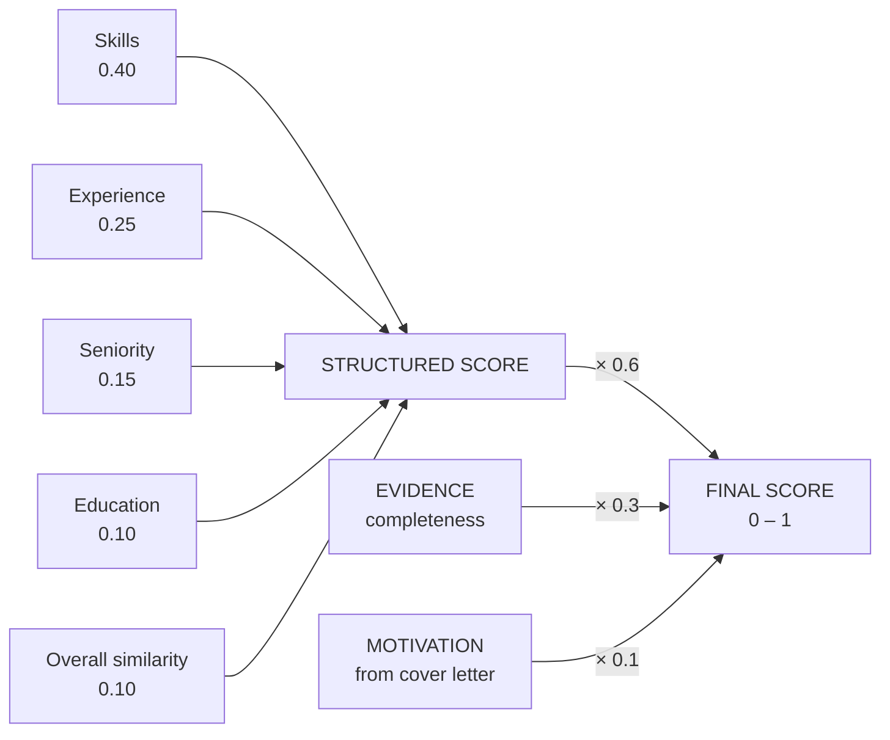
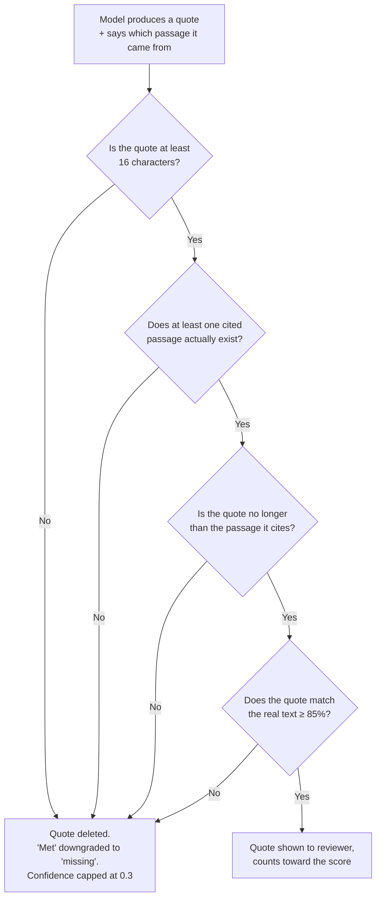
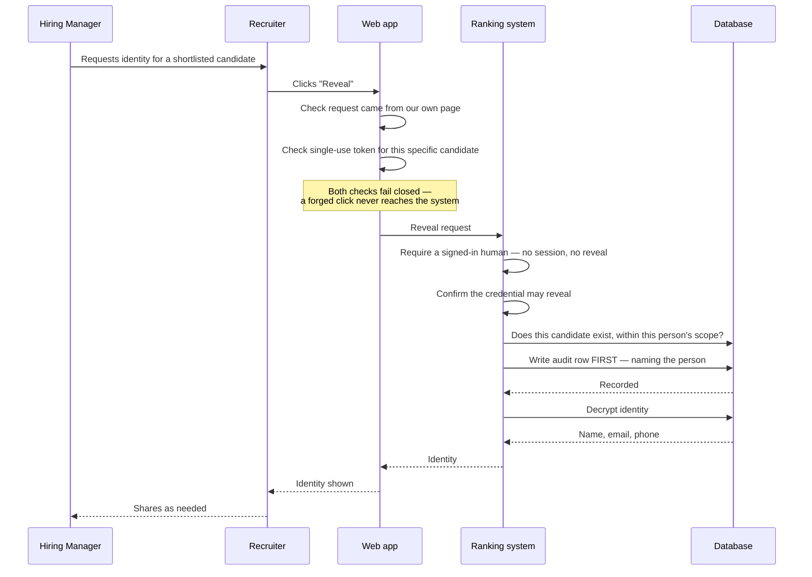

# How this system scores candidates

**Process explainer · For HR & compliance review**

Every number the ranking engine produces, in plain language — what it measures, how much it counts, what is
automatically verified, and the twenty-three decisions and known limitations that need a human owner before
these scores are used in a hiring decision.

> This is the Markdown edition of `docs/process/ranking-metrics-explainer.html`. The two are kept in step;
> the HTML version renders the diagrams below as pictures.

---

## Status of this document

| | |
|---|---|
| **Version** | 2026-08-07. Supersedes the 21 July draft, which was withheld from circulation because two of its claims were wrong. |
| **Basis** | Every figure and behaviour below was read from the running system's source on this date, not from prior documentation or from architecture notes. Where the two disagree, the code is described. |
| **Cleared for** | HR and compliance review, and for use in deciding whether to run the pilot. **Not** a sign-off that the system is ready to inform hiring decisions — see the next section for what is still open. |

**What changed since the July draft.** Two corrections were owed and are made below: the senior-candidate
exemption to the must-have penalty is now disclosed (register item 3), and the anti-fabrication guarantee is
restated honestly rather than absolutely ([how quotes are checked](#how-quotes-are-verified)). Four gaps the
July draft listed have since been closed — reveals are now attributed to a named person, switching off blind
review is now audited, a résumé can no longer fail silently, and a partially-parsed résumé is now flagged and
excluded. Four new findings are disclosed for the first time, all in the next section.

### How to read the labels

| Label | Meaning |
|---|---|
| **[Test-gated]** | Verified automatically on every change; a regression blocks the release. Read the caveat under [what is checked automatically](#what-is-checked-automatically) — the gate has measured blind spots. |
| **[Needs ratification]** | A policy choice encoded as a number. The software cannot tell you if it is *correct* — only HR can. |
| **[Known gap]** | A limitation we have documented and accepted, not one we have hidden. Read these before signing anything. |

---

## Where this stands for the pilot

*Four open items that change how the system may be used today. Read these before anything else on this page.*

### **[Known gap]** 1. A person's role is not yet enforced on actions that change data

**Signing in works properly, and does more than you might assume.** The system is authenticated by default:
everyone signs in through SFU's CAS, there is no anonymous access, a first-time login lands with *no* role at
all until an Admin assigns one, and every action is recorded against the individual who performed it. Reading
is restricted correctly on top of that — a Hiring Manager sees only the requisitions they are assigned to, and
one they are not assigned to is indistinguishable from a requisition that does not exist.

**What is missing is the layer above.** The system knows who you are; it does not yet check your role when you
*do* something. The web interface talks to the ranking service using a single shared recruiter credential, and
the service authorises *that credential* rather than the signed-in person's role. So a Hiring Manager or
Auditor session can today reveal a candidate's identity, switch blind review off, withdraw a candidate, or
re-run a shortlist — for a Hiring Manager within their assigned requisitions; for an Auditor company-wide,
because the Auditor role is deliberately unscoped for reading.

**What to do about it: issue only Recruiter and Admin accounts for the pilot.** That is less a workaround than
a scoping decision — under that configuration every account holder is a role that is *meant* to hold those
powers, so the gap is not reachable in practice, and every action remains attributable to a named person. What
has to wait is handing out Hiring Manager and Auditor logins. Closing this is the first fix queued.

### **[Known gap]** 2. Skill matching only works against job descriptions written in the system's own vocabulary

The system recognises skills from a curated list of roughly nineteen families. A skill outside that list is
stored in a privacy-preserving hashed form that carries no family information, so it can only be matched by an
exact string match — there is no alias resolution and no partial credit between "exact" and "nothing".

Measured on real SFU postings, **47–84% of the required skills fall outside the vocabulary**, and the
resulting skills sub-score — 40% of the structured assessment — collapses to between 0.00 and 0.04:

| Job | Requirements outside the vocabulary | Average skill sub-score |
|---|---|---|
| Real posting — APSA | 16 of 19 | **0.0033** |
| Real posting — Application Administrator | 15 of 20 | **0.0375** |
| Real posting — Program Director | 5 of 6 | **0.0000** |
| Test fixture — Backend Data Engineer | 0 of 5 | 0.6425 |
| Test fixture — Senior Backend Data Engineer | 0 of 6 | 0.5000 |

The effect compounds, because every skill a job description names is currently recorded as mandatory (see
register item 4), so the missing-must-have penalty then halves what is left.

**What to do about it:** for the demo and the early pilot, use job descriptions written in the system's
current skill vocabulary, and say so out loud. Against an unmodified posting the shortlist will show a wall of
"missing · must-have" markers for skills the candidates plainly have. Growing the vocabulary toward the job
families actually being posted is the highest-value open work.

### **[Needs ratification]** 3. Only the top 15 candidates are assessed on evidence — and the rest are shown "0%", not "not assessed"

Evidence gathering and motivation together are 40% of the headline score, and they are computed for the top 15
candidates by structured score only. Everyone below that boundary receives a genuine zero for both. That
cannot change who is ranked above whom, but it does mean a 16th-placed candidate can never demonstrate strong
evidence, and the per-candidate "Why this rank?" panel currently displays *Evidence 0%* for them
affirmatively — indistinguishable from a candidate who was assessed and found lacking.

**What to do about it:** treat rank 16 and below as unassessed, not as weak, and stay inside the top 15 when
using the explanation panel. Making the panel say "not assessed" requires a change to what is recorded during
ranking; it is queued.

### **[Known gap]** 4. Two ranking behaviours that can affect what you see

**Evidence gathering can fail quietly for one candidate.** If the language model itself fails, the whole
shortlist is withheld rather than shown degraded — that is working as designed. But a different kind of
failure (a transient database hiccup while gathering evidence for one person) is absorbed per candidate: that
candidate's evidence score silently becomes zero and the shortlist is published anyway. Because this can hit
someone inside the visible top 15, it can displace a real candidate.

**Candidate recall is not partitioned by requisition.** The first stage searches all résumés in the system and
then filters to the job, rather than searching within the job. Past roughly 150 résumés stored across all
requisitions, a job's own candidates can be crowded out of that first pass even when that job has far fewer
than 50 applicants. A pilot loading several hundred résumés will reach this. Both are queued fixes, and both
are guarded by the ranking-quality gate once fixed.

---

## What this document is for

The system reads résumés, compares them against a job description, and produces a ranked shortlist. Each
candidate gets a single headline score between **0 and 1**, built from smaller scores underneath it.

None of those numbers are objective facts. They are the arithmetic consequence of choices someone made — that
skills matter more than education, that a missing must-have halves a score rather than disqualifying, that a
degree outside the fields a job named earns only partial education credit. Those are *hiring policy*, written
as decimals. This document exposes each one so you can ratify it, change it, or reject it.

Where you see **[Needs ratification]**, the question is not "is this working?" It is "is this what we intend?"

---

## Who does what

*Four system roles, plus the candidate — who is not a user, but is the person all of this is about.*

*Access map. Solid lines are built and working. The dotted line into the audit log is a capability the Auditor
role does not yet have; the two dotted lines back into the system are the unenforced-role gap described above —
read-only roles can currently perform write actions, which is why only Recruiter and Admin accounts should be
issued today.*

**The Recruiter** — `role: recruiter`
Does the operational work: creates the job, uploads résumés, generates the shortlist, and is one of only two
roles the system is *designed* to permit to un-blind a candidate's identity. In practice a Recruiter can do
everything an Admin can except manage user accounts.

**The Hiring Manager** — `role: hiring_manager`
*By design:* read-only and blind, scoped to their own requisitions. Sees the ranked shortlist for jobs they are
assigned to, with names, emails, phone numbers and identifying filenames removed. Should not be able to upload,
re-run a shortlist, or reveal an identity — a reveal should have to go through a Recruiter, which is what makes
it auditable.
*As built:* the read side is enforced exactly as described — an unassigned requisition is indistinguishable
from one that does not exist. **The write side is not.** A Hiring Manager session can currently reveal,
un-blind a job, withdraw a candidate and regenerate a shortlist on the requisitions they are assigned to. See
gap 1 above. Until that is fixed, do not issue this role.

**The Auditor** — `role: auditor`
*By design:* blind reads across the whole company — deliberately unscoped, because oversight of one requisition
is not oversight. The compensating control is that an Auditor's reads are themselves logged.
*As built:* the same unenforced-write gap applies, and because the role is unscoped, an Auditor's write actions
are unscoped too — company-wide. **[Known gap]** There is also still no screen for reading the audit log;
retrieving it today means asking an engineer to run a database query. Do not issue this role yet.

**The Admin** — `role: admin`
Unrestricted, and the only role that can create accounts and assign requisitions. Also the role everyone
silently becomes if authentication is switched off — a development-only boot mode. The system logs a loud
warning at startup when it is in that mode, and refuses to start on several misconfigurations that would
quietly collapse two roles into one. Authenticated mode is the default.

> **[Closed since July] "My jobs" scoping now exists — for reads.**
> The July draft recorded that there was no concept of a person's own requisitions and that any Hiring Manager
> could read every job in the company. That is no longer true: requisitions are assigned to named Hiring
> Managers, and an unassigned job returns exactly the same "not found" response as a job that does not exist —
> so the list of open requisitions cannot be probed either. Auditors remain deliberately company-wide, with
> their reads logged. The limitation that remains is that this scoping is applied to reads only, which is part
> of gap 1 above.

---

## The process, end to end

*From a candidate's file arriving to a ranked shortlist landing in front of a manager.*

*The full pipeline. Consent is a hard gate at the very front — refuse it and no candidate data is stored at
all.*

**Stage 01 — Building the pool.** The system finds up to **50** résumés whose overall content is closest to the
job description, using a mathematical similarity comparison rather than keyword matching. Only résumés uploaded
*for that specific job* are eligible — nothing is pulled from other requisitions. Résumés that failed to
process, that processed only partially, or whose candidate has withdrawn are excluded here rather than ranked
on incomplete data.

**[Known gap]** The similarity search itself runs across every résumé in the system and the job filter is
applied afterwards, so once the whole system holds more than roughly 150 résumés a job's own candidates can be
crowded out of this first pass — even when that job has fewer than 50 applicants. See gap 4 above; this is a
queued fix, and raising the pool size does not address it.

**Stage 02 — Structured scoring.** Every candidate in the pool is scored on five measurable dimensions —
skills, experience, education, seniority and overall similarity. This is the arithmetic layer, and it is fully
deterministic: the same résumé against the same job always produces the same number.

**Stage 03 — Evidence gathering.** For the **top 15 candidates only**, a language model goes back into the
résumé and pulls out the actual sentences that prove each requirement is met. Every quote it produces is then
verified against the real document — see [how quotes are checked](#how-quotes-are-verified). Candidates below
rank 15 score zero on evidence and motivation, which is 40% of the headline number; that is a consequence of
where the work stops, not an assessment of them.

**Stage 04 — Final ranking.** The structured score, the evidence score and the motivation score are combined
into the headline number, and candidates are ordered by it.

---

## What the headline score is made of

*Every candidate's final number, decomposed. All scores run 0 to 1.*

*Two layers of weighting. The five structured dimensions combine into one score, which is then worth 60% of the
headline number.*

### The three top-level components

**Structured score — 0.60.** The measurable, arithmetic assessment: skills, experience, education, seniority,
similarity. Deterministic and repeatable.

**Evidence completeness — 0.30.** What fraction of the job's requirements were proven with a verified quote
from the résumé. A fully met requirement counts 1, a partial counts 0.5, unproven counts 0.

**Motivation — 0.10.** Read from the cover letter only. Themes the model claims to find are only counted if
they clear a confidence bar *and* can be traced to a real sentence — but the average is taken across *all*
themes it proposed, so unverifiable enthusiasm actively drags the score down. A candidate with no cover letter
scores 0 here.

### Inside the structured score

**Skills — 0.40.** Each required skill is scored on years of use, how recently it was used, and how directly it
matches. Recency is banded: used within 2 years scores full marks, within 5 years scores 0.7, older scores 0.4.
A related-but-not-exact skill — one in the same recognised family — earns half credit.

**Missing a must-have halves the entire skills score** — it does not disqualify. A strongly-matched candidate
missing one mandatory skill can still outrank a weaker candidate who has it.

**Unless the candidate is senior, in which case the penalty is lighter.** A candidate with at least **1.5×** the
required years of experience who matched at least **half** of the mandatory skills is penalised **0.75 instead
of 0.5**, and the missing skill is recorded as "implied by experience" rather than "missing". This is a
deliberate rule — the reasoning is that a long career is itself circumstantial evidence for a skill a résumé
did not spell out — but its practical effect is that *more years of experience buys a lighter penalty for
lacking a mandatory skill.* It is years-of-experience-correlated, and it was not disclosed in the July draft.
See register item 3.

**[Known gap]** This whole dimension only works against job descriptions written in the system's curated skill
vocabulary — see gap 2 above, and register items 4 and 17.

**Experience — 0.25.** Measured against the job's stated minimum. Meeting it scores full marks. Substantially
exceeding it is *dampened* — a candidate with more than double the required experience starts losing points,
though never below 0.8. This is deliberate over-qualification handling.

**Seniority — 0.15.** Compares the candidate's most recent job title against the job's title as a similarity
measure — it is not a years check. A candidate whose most recent title could not be read from the résumé scores
0, losing the full 15% to a *parsing* failure rather than to anything about their career. See register item 11.

**Education — 0.10.** Reads the *level* — high school through PhD. Meeting or exceeding the required level
scores full marks; a lower level earns partial credit; no degree scores 0. **Field of study now counts** when
the job names specific fields: a candidate who meets the level but whose qualifying degree is in a field the
job did not name is capped at partial credit. The match is fuzzy, so a minor spelling or format variation of a
named field still counts. A job that names no fields still scores on level alone. A degree whose field could
not be read from the résumé is treated as a non-match — see register item 5 for that trade-off.

**Overall similarity — 0.10.** How closely the résumé as a whole resembles the job description. This score is
*relative to the other candidates in the pool*, not absolute — the strongest résumé in any given batch scores
1.0 here regardless of how good it actually is. If every candidate in a pool scores alike, *everyone* receives
1.0 rather than the dimension being set aside.

---

## How quotes are verified

*The safeguard against a language model inventing a qualification.*

The main risk in using a language model for hiring is fabrication: the model asserting a candidate has an
accreditation they never claimed. Four checks run against that in sequence, and every quote that reaches a
reviewer has passed all four. A quote that fails any of them is **deleted**, its requirement downgraded from
"met" to "missing", and its confidence capped at 0.3 — the reviewer never sees the text, and the score never
gets the credit.

*Evidence verification. Every quote must be a span of one real passage of the candidate's own document — short
enough to fit inside it, and matching it closely.*

The 85% threshold was not guessed. It was chosen by measuring four deliberately fabricated quotes against four
genuine ones and picking the comparison method that rejected all four fakes while accepting all four real
quotes. A looser method that was tested let a fabrication through at 0.855. The length check exists because the
method the threshold uses scores a quote that contains its passage verbatim *plus* arbitrary invented text at a
perfect 1.00, at any length of invention — so "a quote cannot be longer than the thing it quotes" is enforced
as a structural rule with no tolerance at all.

> **[Read this before repeating the guarantee] What this does and does not promise**
>
> **It is not true that a shown quote is guaranteed to be the candidate's exact words.** The honest statement is
> narrower: a shown quote is a close match to a specific, real passage of the candidate's own document, and
> cannot be longer than it. Within that envelope, a quote that keeps most of a real passage and replaces
> **roughly a quarter of it** with invented text still passes — measured at 0.982 against the 0.85 bar on a
> real 148-character passage. Closing that remaining margin is open work.
>
> The check also errs in the other direction. A genuine quote that joins two parts of a passage with an
> ellipsis — one of the most common ways a model quotes a long sentence — scores 0.79 and is *deleted as if
> fabricated*, taking the requirement's "met" status with it. So a missing quote is not proof the candidate
> lacks the qualification.
>
> **What you can rely on:** the failure mode this prevents is the one that matters most — the model inventing a
> credential out of nothing, or attributing one candidate's text to another. It cannot manufacture a
> qualification the résumé has no passage for.

> **[Test-gated] Enforced on every release.**
> Every release must show a **100% verification rate** across the test corpus — every quote surfaced traces to
> real text — and must correctly reject all four known fabrications while accepting all four genuine quotes. If
> any of those fails, the change cannot ship. Note the caveat in the next section about what that corpus can
> and cannot see.

---

## What is checked automatically

*Quality bars that block a release. These do not need your ratification — they need your awareness.*

| Check | Bar | What it prevents |
|---|---|---|
| Precision in top 5 | 100% | A weak or gaming candidate reaching the top five. Set at 100% because a looser 80% bar would be cleared by a random ranker about 40% of the time. |
| Keyword-stuffer excluded | required | A deliberately gamed résumé — engineered to score top-tier on all five structured dimensions — must not reach the top five. Only evidence verification can catch it. |
| Quote verification | 100% | Any unverifiable quote reaching a reviewer. |
| Fabrication rejection | 4 of 4 | A verifier that passes everything unconditionally. |
| Genuine-quote recall | 100% | Over-strict verification silently discarding real qualifications. |
| Ordering controls | 5 pairs | Near-identical candidates differing on one dimension must rank in the correct order, with a real gap — not a coin-flip tie. |
| Identity leakage | 0 leaks | Names, emails or phone numbers reaching the ranking maths or an exported file. |
| Repeatability | 0 rank change | The same candidates scoring differently on a re-run. |

> **[Known gap] Three caveats on "automatic" — the honest scope of the green light**
>
> **1. It is 20 test résumés and one job description, with a stand-in for the language model.** The routine gate
> does not call the real model; the full live measurement against it is a *manual step a human performs before
> merging*, not something the machine enforces.
>
> **2. The test corpus cannot see the vocabulary problem.** Both test job descriptions are written entirely
> within the system's curated skill vocabulary — 0% outside it, against 47–84% for a real SFU posting. That is
> precisely why gap 2 above went unnoticed by a fully green test suite for months. Until the corpus contains an
> out-of-vocabulary requirement, no automatic check can catch a regression in that area.
>
> **3. Some checks in the table are weaker than they read.** The rank-band expectations recorded alongside each
> test résumé are not actually asserted by the harness, and one fixture currently sits outside its own declared
> band. The instruction that a deliberately gamed résumé must rank below every genuinely strong one is written
> as prose in the threshold file rather than enforced as a check. Both are queued.
>
> None of this makes the table false — every row in it does run and does block a release. It means the green
> light covers less ground than the row labels suggest, and the areas it does not cover are named above rather
> than left for you to discover.

---

## Privacy, consent and the audit trail

### Consent is a hard gate

The upload form requires an explicit tick: *"I confirm the candidate consented to this processing
(PIPEDA/FIPPA)."* Without it the file is never sent, never stored, and no processing occurs. The confirmation
is stored permanently against the upload.

> **[Needs ratification] Consent is recorded as a single yes/no per upload batch.**
> There is no timestamp of its own, no record of which consent wording the candidate agreed to, and no
> per-candidate granularity within a batch — one tick covers every file in that upload. If your retention or
> subject-access obligations require per-candidate, per-version consent records, this does not currently meet
> that bar.

### How identity is protected

- Names, emails, phone numbers and cover letter text are **encrypted in the database**. The application only
  ever handles encrypted bytes.
- Email addresses are additionally stored as a one-way hash, deliberately unencrypted — this is what lets you
  locate a candidate by email in response to a subject-access request without unlocking anything.
- Identity is **stripped before any text reaches the ranking maths**, including out of the numeric vectors. The
  system treats those vectors as personal data in their own right.
- Under blind review, the Hiring Manager's view removes names, emails, phones and identifying filenames —
  including from quoted passages, so a résumé header cannot leak a name through an evidence quote.

### The reveal — the one way identity is un-blinded

*The reveal sequence. The audit row is written* before *anything is decrypted — so an identity cannot be viewed
without leaving a record, and the record names a person.*

The ordering here is deliberate and worth understanding: the signed-in human is required before anything else,
permission is checked before the candidate's existence is probed, and the audit entry is written before
decryption. A rejected attempt cannot create a misleading audit row, and a successful one cannot avoid creating
a real one. A reveal blocked because the candidate is outside the person's assigned requisitions returns the
same "not found" as a candidate who does not exist, decrypts nothing, and writes no audit row.

Two bulk reveal routes were removed during this work — including one that de-anonymised an entire shortlist in
a single unaudited download.

> **[Closed since July] The audit log now names the person who revealed.**
> The July draft recorded that reveals through the web interface were attributed to `api` rather than to an
> individual, and that individual accountability for un-blinding could not be demonstrated. That is fixed. A
> reveal now **requires an authenticated human session** and is refused outright without one, and the audit row
> is keyed to that person's account. You can now prove who revealed a candidate's identity, when, for which
> job, and from which screen. One exception, by design: in the development-only anonymous boot mode there is no
> real person to attribute to, so the row is recorded as a system action with the boot mode named. That mode is
> not the default and is not for production.

> **[Closed since July] Turning blind review off is now audited.**
> The July draft called this the single item on the page most worth fixing: switching off a job's blind review
> permanently un-blinds every candidate on it for every future viewer, and wrote no audit record at all. It now
> writes exactly one audit record, attributed the same way a reveal is, and only when the setting actually
> changes. What remains is *who* may do it — see gap 1 above. The action is recorded; it is not yet restricted
> to the roles that should be able to perform it.

### What is not yet protected

> **[Known gap] Retention is recorded but never enforced.**
> Each job carries a retention period — 180 days by default, settable between 30 and 730. Nothing in the system
> acts on it. There is no scheduled deletion, no expiry sweep, and no purge: résumés, extracted text and
> shortlists persist until someone removes them by hand. If your retention schedule is a commitment to
> candidates or a regulatory obligation, **it is currently a manual process**, and this field records an
> intention rather than a control. Related and also open: there is no candidate-initiated erasure. Withdrawing
> a candidate removes them from ranking and from every view, but does not delete their data.

> **[Known gap] Two smaller storage caveats worth recording.**
> **The original résumé files are not encrypted.** Names, emails, phone numbers and cover letter text are
> encrypted in the database, but the uploaded PDF or Word file itself is stored on disk with restrictive file
> permissions and no encryption. Anyone with filesystem access to the server reads them directly.
> **The email lookup hash is unsalted.** The deliberately-unencrypted hash that lets you find a candidate by
> email in response to a subject-access request is a plain hash of the address. A party who already holds a list
> of email addresses could confirm whether any of them appears in the system. The equivalent hash used for
> skills refuses to start without a salt; this one does not — an inconsistency worth resolving.

---

## The ratification register

*Twenty-three items encoded in the software today: thirteen policy decisions that need an owner to confirm they
reflect our hiring policy, and ten known limitations that need a decision about whether we can live with them.
Four items on the July draft's register have closed and are listed after the table.*

| # | Decision as it stands today | Why it needs a human | Status |
|---|---|---|---|
| 1 | Skills are worth 40% of the structured score, experience 25%, seniority 15%, education 10%, overall similarity 10% — and the structured score is 60% of the headline number, evidence 30%, motivation 10%. | A defensible weighting for technical roles. May be indefensible for credential-regulated ones. | Ratify |
| 2 | Missing a mandatory skill halves the skills score rather than excluding the candidate. | Determines whether "must-have" is genuinely a requirement or merely a strong preference. | Ratify |
| 3 | **The penalty in item 2 is softened to 0.75 for a senior candidate** — one with at least 1.5× the required years who also matched at least half of the mandatory skills. The missing skill is then labelled "implied by experience" rather than "missing". | **Not disclosed in the July draft; this is the correction.** More years of experience buys a lighter penalty for lacking a mandatory skill. The rationale is that a long career is circumstantial evidence for an unstated skill, but the effect is a years-of-experience-correlated advantage, which carries the same age-proxy exposure as item 8 and interacts with it. Both thresholds and the 0.75 are configurable. | Ratify |
| 4 | Every skill named in a job description is recorded as **mandatory**. "Nice to have" cannot be expressed today, and nice-to-have skills contribute nothing to the structured score in any case. | This is why the must-have penalty in item 2 fires for nearly every candidate. Whether a requirement is genuinely mandatory is a hiring-policy judgment the system currently makes for you, always in the strictest direction. Making it expressible is engineering work; deciding the default is HR's. | Gap |
| 5 | Field of study caps education at partial credit when a qualifying-level degree is in a field the job did not name; a degree whose field cannot be read is treated as non-matching; the field match is fuzzy at a 0.85 similarity bar. | Resolves the former "field ignored" gap, but the cap size, the fuzzy bar, and penalising an unreadable field are hiring-policy choices — the last can under-credit a genuinely qualified candidate whose résumé parse dropped the field. All three are configurable without a code change. | Ratify |
| 6 | Only the top 15 candidates receive evidence review, and those below are displayed as scoring 0% on evidence rather than as unassessed. | Candidate 16 scores zero on 40% of the headline number by structure, not by merit — a hard cliff, and one the explanation panel currently presents as a measured result. Ranking order is unaffected, but upward mobility is suppressed and the number is not comparable across the boundary. | Ratify |
| 7 | A skill with no stated duration is treated as fully meeting the years requirement. | A generous default. Résumés rarely state per-skill years, so this fires often. | Ratify |
| 8 | Candidates with more than 2× the required experience are scored down, never below 0.8. | Deliberate dampening. Carries obvious age-proxy risk and should be a conscious, defended choice. | Ratify |
| 9 | Skills used within 2 years score full marks; within 5 years 0.7; older 0.4. | Penalises career breaks, parental leave and caring responsibilities. Human-rights exposure. | Ratify |
| 10 | Overall similarity is scored relative to the batch, not absolutely — and if every candidate in a pool scores alike, all of them receive full marks. | The best of a weak pool scores full marks. Scores are not comparable between requisitions. | Ratify |
| 11 | Seniority is the similarity between the candidate's most recent job title and the job's title. A title that could not be read from the résumé scores 0. | A parsing failure costs the candidate the entire 15% sub-weight, indistinguishably from a genuine seniority mismatch. Worth deciding whether an unreadable title should instead be neutral. | Ratify |
| 12 | A cover letter is worth 10%; candidates without one score zero there. Themes the model claims to find count only if verified, but the average is taken over all themes proposed. | A structural penalty for not submitting an optional document. | Ratify |
| 13 | If the language model fails during ranking — either it times out or errors, or it returns malformed or empty output — the shortlist is withheld rather than shown with a silently-zeroed candidate. The job displays "Waiting for AI to rank candidates…" and retries automatically, up to 20 times by default, before it stops and stays visibly in that state for a human to notice. | Closes a former gap: a technical failure can no longer look identical to a genuinely weak candidate. What is left to own is the policy — how many times to retry and how long to wait between attempts before giving up and asking a human to re-run it. | Ratify |
| 14 | Consent is one yes/no per upload batch, with no wording version and no timestamp of its own. | May not satisfy per-candidate consent evidence obligations. | Ratify |
| 15 | A retention period is recorded on every job (180 days by default) but nothing ever acts on it. No expiry, no deletion, no purge. | The field reads as a control and is not one. If retention is a commitment to candidates or a regulatory obligation, it is currently manual. There is also no candidate-initiated erasure. | Gap |
| 16 | Sign-in, role assignment and attribution all work; the signed-in person's role is enforced on reads but not on actions. A Hiring Manager or Auditor session can reveal an identity, un-blind a job, withdraw a candidate or re-run a shortlist — and for an Auditor, company-wide. | **The item that gates which accounts may be issued.** Every action is still audited under the named person who performed it, so nothing is invisible — but the read-only roles are not yet read-only. Interim control: issue only Recruiter and Admin accounts, under which the gap is unreachable. | Gap |
| 17 | Skill matching only works against job descriptions written in the system's curated vocabulary of roughly nineteen families. Real SFU postings are 47–84% outside it and score 0.00–0.04 on skills. | **Decides whether a pilot produces meaningful output at all.** Outside the vocabulary there is exact-string matching or nothing — no aliases, no family credit. Combined with item 4, most candidates then take the must-have penalty as well. | Gap |
| 18 | Evidence gathering absorbs a non-model failure for one candidate: their evidence score silently becomes zero and the shortlist publishes anyway. | Unlike the model failure in item 13, this one does not withhold the shortlist, and it can hit a candidate inside the visible top 15 — displacing a real candidate on the strength of a transient database error. | Gap |
| 19 | The first-stage candidate search runs across all résumés in the system and filters to the job afterwards. | Past roughly 150 résumés stored system-wide, a job's own candidates can be crowded out of the first pass even when that job has fewer than 50 applicants. A pilot loading several hundred résumés reaches this. | Gap |
| 20 | Quote verification has a measured margin in both directions: a quote that keeps most of a real passage and replaces about a quarter of it with invented text still passes, and a genuine ellipsis-joined quote is deleted as if fabricated. | The anti-fabrication control is strong but not absolute, and the July draft overstated it. Decide whether the residual is acceptable for the pilot, and note that a missing quote is not evidence the candidate lacks the qualification. | Gap |
| 21 | There is no screen for reading the audit log. | The records exist and are now attributable to individuals, but retrieving them means asking an engineer to run a database query — which is not an oversight capability an Auditor can exercise independently. | Gap |
| 22 | Uploaded résumé and cover letter files are stored with restrictive file permissions but are not encrypted at rest. The identity fields inside the database are. | Anyone with filesystem access to the server reads the original documents directly. | Gap |
| 23 | The email lookup hash — deliberately unencrypted so subject-access requests can be answered — is unsalted. | A party already holding a list of email addresses could confirm whether any of them is in the system. The equivalent skill hash refuses to start without a salt; this one does not. | Gap |

### Closed since the July draft

Four items that appeared on the previous register are no longer open. They are listed here rather than deleted,
so that a reader comparing the two versions can see what moved.

- **[Closed] Reveals were attributed to `api`, not a named person.** A reveal now requires an authenticated
  human session and is refused without one; the audit row names that person.
- **[Closed] Switching off blind review wrote no audit record.** It now writes exactly one, attributed the same
  way — though who may perform it is still item 16.
- **[Closed] Any Hiring Manager could read every job in the company.** Requisitions are now assigned, and an
  unassigned job is indistinguishable from a nonexistent one. Auditors remain company-wide by design, with
  their reads logged.
- **[Closed] A résumé could silently fail to process, and stay invisible.** Processing state is now honest —
  see the operational realities below.

---

## Three operational realities worth knowing

**Scores from résumé-to-job matching are not comparable to job-to-résumé matching.** The reverse direction omits
the motivation component entirely, so its scores top out at 0.9 rather than 1.0. Never place the two side by
side. Ranking quality in that direction is also not yet covered by the automatic checks, and the fail-closed
behaviour in register item 13 does not extend to it.

**A résumé that fails to process now says so.** The July draft recorded that a failed résumé stayed marked
"uploaded" indefinitely — indistinguishable from one that had only just arrived, invisible to the shortlist,
and never ranked. That happened in practice: on 19 July 2026 a batch of 16 sat unprocessed for roughly eighteen
hours showing no error at any point. Processing state is now honest: a résumé moves to "parsing" when work
starts and to "failed" when the retries are exhausted, so a stalled batch is visible rather than silent. The
underlying cause of that incident was a processing timeout set below the time the model actually needed; the
timeout is now configurable and set appropriately.

**A résumé can also process only partially — this is flagged, not silent.** In that same batch, 10 of the 16
finished with their skills extraction having failed, falling back to a basic keyword scan. A résumé in that
state is now marked **degraded**, counted separately in the per-job status breakdown ("N parsed (M degraded)"),
and badged on both the résumé list and its detail page with the reason. It is *excluded from shortlists and
reverse-match results* until it is re-parsed, rather than ranked on incomplete skill data. Re-parsing today
means re-uploading the résumé; a dedicated re-parse action is a documented follow-up, not yet built.

---

## Suggested next steps

1. **Decide whether to run the pilot with Recruiter and Admin accounts only.** That is the interim control for
   register item 16, and it is available today at no engineering cost. Handing out Hiring Manager or Auditor
   logins is what has to wait.
2. **Decide what the pilot is trying to learn**, given register item 17. Against job descriptions written in
   the system's current skill vocabulary the pipeline works as documented; against unmodified postings the
   skills dimension does not. A pilot scoped to the first is a real test of the ranking, evidence and privacy
   machinery. A pilot on the second will mostly measure the vocabulary gap.
3. **Assign an owner to each of the twenty-three register items.** The thirteen marked "Ratify" need a
   documented yes or a changed number, and all of them are configurable without a code change or a release. The
   ten marked "Gap" need a decision on whether the pilot can proceed with them open.
4. **Decide whether items 3, 8 and 9 survive legal review** before first production use. The senior exemption,
   over-qualification dampening and skill-recency banding are the three most likely to produce adverse impact,
   and item 3 compounds the other two rather than sitting beside them.
5. **Treat items 15 and 22 as commitments to check against policy** before real candidate data is loaded at any
   volume. Unenforced retention and unencrypted source documents are both easier to fix before a pilot fills
   the system than after.

---

Prepared for HR and compliance review, 7 August 2026. Every figure and behaviour here was read from the running
system's source on that date, not from prior documentation. Where the system's own architecture records
disagree with the code, the code is described.

Scores, weights and thresholds are configurable — changing a ratified number does not require a code change or
a release. Items marked as gaps require engineering work and are tracked as such.

This document deliberately records what does not work alongside what does. A reader who finds something here
that contradicts the system's behaviour should treat that as a defect in this document and say so — it is
maintained against the code, not against intentions.
